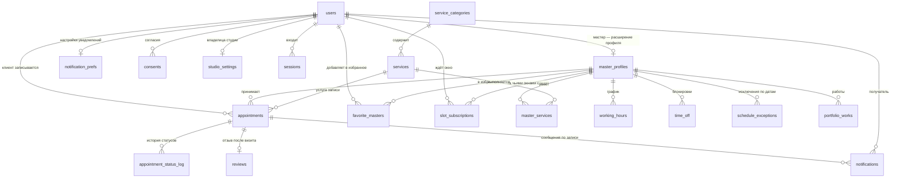

# Схема базы данных сервиса «Варвара»

Документ описывает, какие таблицы нужны сервису онлайн-записи ногтевой студии «Варвара», какие в них поля и как они связаны. Схема выведена из экранов прототипа и карты связей — ничего «на будущее», только то, что реально показывают или собирают экраны.

**Основание:** карта связей прототипа (`Карта связей.dc.html`) и исходники семи страниц — `Варвара - Сайт.dc.html`, `Вход.dc.html`, `Кабинет.dc.html`, `Клиент.dc.html`, `Админ-панель.dc.html`, `Варианты.dc.html`, а также данные-заглушки `assets/varvara-data.js` и `assets/varvara-admin-data.js`.

**СУБД:** SQLite — через встроенный в Node 24 модуль `node:sqlite`, без внешних зависимостей и отдельной службы. База лежит одним файлом в папке проекта.

Соглашения, вынужденные тем, что в SQLite мало типов:

| В документе | В базе |
|---|---|
| Момент времени | `TEXT` в ISO-8601 UTC: `2026-08-15T15:00:00Z` |
| Дата, время суток | `TEXT`: `2026-08-15`, `10:00` |
| Деньги | `INTEGER`, копейки |
| Флаг | `INTEGER` 0/1 с проверкой `CHECK` |
| Набор значений | `TEXT` с проверкой `CHECK (… IN (…))` вместо типа-перечисления |
| Идентификатор | `INTEGER PRIMARY KEY` |

Главное следствие выбора описано в разделе 8, пункт 11: запрет двух записей внахлёст держится не на ограничении `EXCLUDE`, которого в SQLite нет, а на триггерах.

**Статус:** проект схемы. Миграций и кода на этом этапе нет.

---

## 1. Экраны и данные

### Страница 1. Сайт студии — лендинг

| Блок | Что видно на экране | Откуда данные |
|---|---|---|
| Шапка | Логотип, меню, кнопки «Войти» и «Записаться» | статика |
| Первый экран | Заголовок, адрес, фото студии, средняя оценка «4.9 · 265 отзывов» | `studio_settings`, `content_blocks`, агрегат `reviews` |
| Почему мы | Четыре пункта с иконками: стерильность, честное время, запись в Telegram, свои материалы | `content_blocks` |
| Услуги | Фильтр категорий, карточки: название, описание, длительность, цена, «от», бейдж «хит» | `services`, `service_categories` |
| Мастера | Имя, специализация, рейтинг, число отзывов | `users`, `master_profiles`, категории из `master_services`, агрегат `reviews` |
| Работы | Галерея работ с подписями | `portfolio_works` |
| Футер | Адрес, часы работы, телефон, бот, почта | `studio_settings`, `working_hours` |

### Страница 1а. Модалка записи — четыре шага

| Шаг | Что видно | Откуда данные |
|---|---|---|
| Услуга и мастер | Карточки услуг, чипы мастеров + «Любой свободный» | `services`, `master_services` |
| Дата и время | Лента дат со счётчиком свободных окон, слоты по группам утро/день/вечер, занятые перечёркнуты | **вычисляется** (раздел 5) |
| Контакты | Имя, телефон, комментарий, чекбокс согласия на обработку данных | пишет `users`, `consents` |
| Подтверждено | Карточка записи, «Запись №1042» | пишет `appointments` |

Карта связей фиксирует: **записаться можно без входа**. Значит клиент создаётся по имени и телефону, без пароля.

### Страница 2. Вход

Выбор роли (клиент · мастер · администратор), логин (телефон у клиента, email у мастера и админа), пароль. Данные: `users` — `role`, `phone`, `email`, `password_hash`. Успешный вход открывает сеанс в `sessions`; ссылка «Выйти» в шапке кабинета его закрывает.

### Страница 3. Кабинет клиента (сайт)

| Вкладка | Что видно | Откуда данные |
|---|---|---|
| Мои записи | Ближайшие и история: когда, услуга, мастер, цена, адрес, статус; кнопки «Перенести», «Отменить», «Повторить» | `appointments` + `services` + `users` |
| Профиль | Имя, аватар, телефон, три переключателя уведомлений, адрес студии, любимые мастера | `users`, `notification_prefs`, `slot_subscriptions`, `studio_settings`, `favorite_masters` |

Переключатель подписан «Новые окна **у Варвары**» — то есть подписка всегда на конкретного мастера, а не на студию целиком. Это отдельная таблица `slot_subscriptions`, а не флажок.

### Страница 4. Мини-апп клиента (Telegram)

Тот же клиент с телефона: таб-бар «Записаться» / «Мои записи» (с бейджем-счётчиком) / «Профиль». Шаги записи — услуга → мастер → время → шторка проверки → готово. Данные те же, что у страниц 1а и 3, плюс `users.telegram_user_id` — чтобы бот знал, кому писать.

### Страница 5. Админ-панель и кабинет мастера

| Раздел | Что видно | Откуда данные |
|---|---|---|
| Расписание | KPI дня: записей, ожидаемая выручка, ждут подтверждения, свободных окон. Сетка 10:00–21:00 по колонке на мастера, блоки записей окрашены по статусу | `appointments`, `working_hours`, `time_off` |
| Записи | Таблица: когда, клиент + телефон, услуга, мастер, сумма, источник, статус, кнопка «Подтвердить». Фильтры по статусу, поиск по имени и телефону | `appointments`, `users`, `services` |
| Услуги | Прайс с переключателем видимости, форма новой услуги: название, длительность, цена, категория, «Показывать в онлайн-записи» | `services`, `service_categories` |
| Настройки | Онлайн-запись вкл/выкл, ручное подтверждение, напоминание за 2 часа, уведомлять о новых записях, часы работы Пн–Сб и Вс, карточка бота «@varvara_nails_bot · подключён» | `studio_settings`, `working_hours` |

Мастер заходит в ту же панель, но видит только свой столбец расписания и свои записи; «Услуги» и «Настройки» ей недоступны. Это правило прав доступа, отдельных таблиц не требует — фильтр по `appointments.master_id` и проверка `users.role`.

### Страница 6. Варианты компонентов

Справочная страница вне флоу. Для схемы даёт одно: **фиксированный набор статусов записи** — `confirmed`, `pending`, `cancelled`, `done`. Прототип показывает эти четыре бейджа; схема добавляет к ним пятый, `no_show`, — см. раздел 8, пункт 7. Подписи и цвета бейджей живут в `appointment_status_labels`.

---

## 2. Список таблиц

| № | Таблица | Назначение |
|---|---|---|
| 1 | `users` | Люди сервиса: клиенты, мастера, администраторы. Вход и контакты |
| 2 | `master_profiles` | Витринные данные мастера: специализация, фото, участие в онлайн-записи |
| 3 | `service_categories` | Категории прайса: Маникюр, Педикюр, Наращивание, Дизайн |
| 4 | `services` | Прайс: название, длительность, цена, видимость |
| 5 | `master_services` | Какая мастер какие услуги делает, с личной ценой и длительностью |
| 6 | `studio_settings` | Одна строка настроек студии: адрес, часовой пояс, правила записи, бот |
| 7 | `working_hours` | Регулярный недельный график работы студии и мастеров |
| 8 | `time_off` | Разовые блокировки времени: отпуск, перерыв, больничный |
| 9 | `appointments` | Записи клиентов — центральная таблица |
| 10 | `appointment_status_log` | История смены статусов: кто, когда, из какого в какой |
| 11 | `consents` | Согласия на обработку персональных данных и на рассылки |
| 12 | `notification_prefs` | Три переключателя уведомлений в профиле клиента |
| 13 | `notifications` | Очередь и журнал сообщений: подтверждения, напоминания |
| 14 | `reviews` | Оценки и отзывы после визита — источник рейтинга мастера |
| 15 | `favorite_masters` | Любимые мастера клиента |
| 16 | `portfolio_works` | Работы для галереи на лендинге |
| 17 | `sessions` | Открытые сеансы входа: что стоит за экраном «Вход» и ссылкой «Выйти» |
| 18 | `slot_subscriptions` | Подписки «Новые окна у Варвары» — на конкретного мастера |
| 19 | `content_blocks` | Редактируемые блоки лендинга: преимущества студии и фото на первом экране |
| 20 | `schedule_exceptions` | График на конкретную дату: праздник, разовая смена, нерабочий день |
| 21 | `appointment_status_labels` | Как показывать статусы: подпись, цвет, порядок в фильтрах |

Наборы значений — `role`, `status`, `source`, `kind` — заданы проверками `CHECK` прямо в колонках: типов-перечислений в SQLite нет. И одно материализованное представление — `master_ratings`; это не таблица, а сохранённый результат запроса, см. конец раздела 4.

---

## 3. Связи



Двух таблиц на диаграмме нет, и это не пропуск. `content_blocks` ни с чем не связана — это тексты лендинга, самостоятельные сами по себе. `appointment_status_labels` связана с записями не внешним ключом, а типом `appointment_status`: её первичный ключ и есть значение статуса, поэтому на схеме связей ей нечего показать.

---

## 4. Таблицы подробно

Обозначения: **PK** — первичный ключ, **FK** — внешний ключ, **U** — уникальное значение. «Обяз.» — поле не может быть пустым (`NOT NULL`).

### 4.1 `users` — люди сервиса

Одна таблица на всех: клиенток, мастеров и администраторов. Роль определяет, что человек видит после входа.

| Поле | Тип | Обяз. | Ключ | Описание |
|---|---|---|---|---|
| `id` | `INTEGER` PK | да | PK | |
| `role` | `TEXT` + CHECK | да | | `client` · `master` · `admin` |
| `full_name` | `TEXT` | да | | «Марина», «Варвара» |
| `photo_url` | `TEXT` | нет | | Аватар. Пустой — интерфейс рисует кружок с инициалом, как в прототипе |
| `phone` | `TEXT` | нет | U | В формате E.164: `+79210000000` |
| `email` | `TEXT` NOCASE | нет | U | Логин мастера и админа |
| `password_hash` | `TEXT` | нет | | **Только хеш** (Argon2id). Пустой у клиентов, записавшихся без регистрации |
| `password_changed_at` | `TEXT` ISO-8601 UTC | нет | | Когда пароль задали или сменили. Сеансы, открытые раньше этого момента, считаются недействительными |
| `telegram_user_id` | `INTEGER` | нет | U | Кому бот шлёт подтверждения |
| `telegram_username` | `TEXT` | нет | | Для поиска в админке |
| `is_active` | `INTEGER` 0/1 | да | | `false` — доступ закрыт, данные сохранены |
| `created_at` | `TEXT` ISO-8601 UTC | да | | |
| `updated_at` | `TEXT` ISO-8601 UTC | да | | |

Проверки на уровне таблицы:

- `CHECK (role <> 'client' OR phone IS NOT NULL)` — клиента невозможно создать без телефона: иначе некому звонить и не с чем связать повторный визит.
- `CHECK (role = 'client' OR (email IS NOT NULL AND password_hash IS NOT NULL))` — мастер и админ обязаны иметь логин и пароль, вход по телефону им экран «Вход» не предлагает.
- `CHECK (phone IS NULL OR phone ~ '^\+[1-9][0-9]{7,14}$')` — телефон хранится в одном виде, иначе поиск в админке не найдёт клиентку по номеру.

Плюс дополнительное ограничение `UNIQUE (id, role)`. Само по себе оно ничего не запрещает — `id` и так первичный ключ. Оно существует ради того, чтобы на пару «пользователь + роль» могли ссылаться внешние ключи других таблиц: без уникального индекса по этой паре сослаться на два столбца сразу нельзя. Как это используется — в `master_profiles`.

Пароль в открытом виде не хранится нигде и ни в каком поле. При входе сравнивается хеш от введённого пароля с `password_hash`.

Смена пароля не требует обходить таблицу сеансов и закрывать их по одному: сеанс считается действительным, только если `sessions.issued_at >= users.password_changed_at`. Одна запись времени разом отключает все устройства, где вход был выполнен старым паролем, — это то, чего человек и ждёт, меняя пароль после утечки.

### 4.2 `master_profiles` — витрина мастера

Расширение `users` для роли `master`: то, что видно клиентке на лендинге и в шаге выбора мастера.

| Поле | Тип | Обяз. | Ключ | Описание |
|---|---|---|---|---|
| `user_id` | `INTEGER` | да | PK, FK → `users(id, role)` | Один профиль на одного пользователя |
| `role` | `TEXT` + CHECK | да | FK → `users(id, role)` | Всегда `master`. `CHECK (role = 'master')`, значение по умолчанию `'master'` |
| `bio` | `TEXT` | нет | | |
| `photo_url` | `TEXT` | нет | | |
| `accepts_online_booking` | `INTEGER` 0/1 | да | | `false` — мастер не появляется в онлайн-записи, но продолжает работать в панели |
| `uses_studio_hours` | `INTEGER` 0/1 | да | | `true` — мастер работает по часам студии, своих строк в `working_hours` нет. `false` — график только свой, и день без строки означает выходной |
| `sort_order` | `INTEGER` | да | | Порядок карточек на лендинге |
| `created_at` | `TEXT` ISO-8601 UTC | да | | |
| `updated_at` | `TEXT` ISO-8601 UTC | да | | |

Внешний ключ здесь составной — `(user_id, role) → users(id, role)`, — и в этом весь смысл столбца `role`. Обычная ссылка на `users.id` пропустила бы в профили мастеров кого угодно, включая клиентку: тип у `id` один и тот же. Составная ссылка вместе с `CHECK (role = 'master')` делает это невозможным на уровне базы: строка в `master_profiles` существует только для пользователя, у которого роль действительно `master`. А поскольку `appointments.master_id` ссылается на `master_profiles`, а не на `users`, запись «к клиентке» тоже становится невозможной — гарантия распространяется дальше по цепочке.

Побочный эффект: смена роли пользователя с `master` на другую упирается во внешний ключ, пока у него есть профиль мастера. Это желаемое поведение — сначала нужно решить судьбу его расписания и записей.

Рейтинг (`4.9`) и число отзывов (`128`) в таблице **не хранятся** — считаются из `reviews`. Подпись на карточке («Маникюр, наращивание, дизайн») тоже не хранится: это категории услуг, которые мастер делает, собранные из `master_services` через `services.category_id`. Отдельное текстовое поле рядом со списком услуг разошлось бы с ним при первой же правке прайса.

### 4.3 `service_categories` — категории прайса

Чипы фильтра «Маникюр · Педикюр · Наращивание · Дизайн» на лендинге и в мини-аппе.

| Поле | Тип | Обяз. | Ключ | Описание |
|---|---|---|---|---|
| `id` | `INTEGER` PK | да | PK | |
| `slug` | `TEXT` | да | U | `manicure`, `pedicure` — для ссылок и фильтра |
| `title` | `TEXT` | да | | «Маникюр» |
| `sort_order` | `INTEGER` | да | | |
| `created_at` | `TEXT` ISO-8601 UTC | да | | |

### 4.4 `services` — прайс

| Поле | Тип | Обяз. | Ключ | Описание |
|---|---|---|---|---|
| `id` | `INTEGER` PK | да | PK | |
| `category_id` | `INTEGER` | да | FK → `service_categories.id` | |
| `slug` | `TEXT` | да | U | `man-cover`, `ext` |
| `title` | `TEXT` | да | | «Маникюр с покрытием» |
| `description` | `TEXT` | нет | | «Аппаратный, гель-лак» |
| `duration_min` | `INTEGER` | да | | Длительность в минутах: `90`. `CHECK (duration_min > 0 AND duration_min % 5 = 0)` |
| `duration_is_from` | `INTEGER` 0/1 | да | | `true` — на карточке «от 20 мин», как у дизайна ногтей. Отдельный флаг от `price_is_from`: у наращивания цена «от», а длительность точная |
| `buffer_after_min` | `INTEGER` | нет | | Время на уборку после услуги. Пусто — берётся `studio_settings.default_buffer_min`. В расчёте окон занимает место наравне с самой услугой, но клиентке не показывается. `CHECK (buffer_after_min >= 0)` |
| `price_kopecks` | `INTEGER` | да | | Цена в копейках: `320000` = 3 200 ₽. `CHECK (price_kopecks >= 0)` |
| `price_is_from` | `INTEGER` 0/1 | да | | `true` — на карточке пишем «от 5 500 ₽» |
| `badge` | `TEXT` | нет | | «хит» |
| `is_active` | `INTEGER` 0/1 | да | | Переключатель в разделе «Услуги» |
| `is_online_bookable` | `INTEGER` 0/1 | да | | Чекбокс «Показывать в онлайн-записи» |
| `sort_order` | `INTEGER` | да | | |
| `created_at` | `TEXT` ISO-8601 UTC | да | | |
| `updated_at` | `TEXT` ISO-8601 UTC | да | | |

Два флага, а не один: услугу «Ремонт ногтя» мастер делает и пробивает вручную, но в онлайн-запись её не пускают. `is_active = false` убирает услугу отовсюду.

### 4.5 `master_services` — кто что делает

Из карты связей: «У каждой — своя специализация». Лена не берёт наращивание, Ая не делает педикюр — при выборе «Наращивание» в списке мастеров не должно быть Лены.

| Поле | Тип | Обяз. | Ключ | Описание |
|---|---|---|---|---|
| `master_id` | `INTEGER` | да | PK, FK → `master_profiles.user_id` | |
| `service_id` | `INTEGER` | да | PK, FK → `services.id` | |
| `duration_min_override` | `INTEGER` | нет | | Своя длительность: у новенькой наращивание идёт 3.5 часа |
| `price_kopecks_override` | `INTEGER` | нет | | Своя цена |
| `is_active` | `INTEGER` 0/1 | да | | Временно не берёт эту услугу |
| `created_at` | `TEXT` ISO-8601 UTC | да | | |

Первичный ключ составной — пара «мастер + услуга».

### 4.6 `studio_settings` — настройки студии

Ровно одна строка. Питает футер лендинга, карточку адреса в профиле и весь раздел «Настройки» в админке.

| Поле | Тип | Обяз. | Ключ | Описание |
|---|---|---|---|---|
| `id` | `INTEGER` | да | PK | `CHECK (id = 1)` — вторую строку создать нельзя |
| `title` | `TEXT` | да | | «Варвара» |
| `city` | `TEXT` | да | | «Санкт-Петербург» |
| `address_line` | `TEXT` | да | | «ул. Рубинштейна, 24» |
| `address_note` | `TEXT` | нет | | «Второй этаж, домофон 24» |
| `timezone` | `TEXT` | да | | `Europe/Moscow` — см. раздел 6 |
| `phone` | `TEXT` | да | | |
| `email` | `TEXT` | нет | | |
| `telegram_bot_username` | `TEXT` | нет | | `varvara_nails_bot` |
| `bot_status` | `TEXT` | да | | `connected` · `disconnected` · `error`. Карточка «Бот записи» показывает «подключён» — это состояние нужно откуда-то брать |
| `bot_connected_at` | `TEXT` ISO-8601 UTC | нет | | Когда бота подключили |
| `owner_user_id` | `INTEGER` | нет | FK → `users.id` | Кому слать «Уведомлять о новых записях». Без этого поля адресат уведомления не определён |
| `online_booking_enabled` | `INTEGER` 0/1 | да | | «Онлайн-запись включена» |
| `manual_confirmation_required` | `INTEGER` 0/1 | да | | «Подтверждать записи вручную»: новая запись приходит со статусом `pending` |
| `reminder_lead_min` | `INTEGER` | да | | «Напоминание за 2 часа» = `120` |
| `notify_owner_on_new_booking` | `INTEGER` 0/1 | да | | Сообщение владелице в Telegram |
| `free_cancellation_lead_min` | `INTEGER` | да | | «Отмена и перенос бесплатны за 4 часа» = `240` |
| `booking_horizon_days` | `INTEGER` | да | | На сколько дней вперёд открыта запись — верхняя граница расчёта окон |
| `min_lead_time_min` | `INTEGER` | да | | Нижняя граница: за сколько минут до начала ещё можно записаться. Без неё «сегодня 17:58» остаётся доступным окном на 18:00 |
| `pending_ttl_min` | `INTEGER` | да | | Сколько минут неподтверждённая запись держит время. По истечении переходит в `cancelled`, и окно возвращается в расчёт |
| `default_buffer_min` | `INTEGER` | да | | Уборка после услуги по умолчанию. Услуга может назначить своё значение в `services.buffer_after_min` |
| `guest_booking_mode` | `TEXT` | да | | `open` · `verify_by_code` · `require_account` — как поступать с записью без входа. Разбор в разделе 11 |
| `slot_step_min` | `INTEGER` | да | | Шаг сетки времени: `30` |
| `updated_at` | `TEXT` ISO-8601 UTC | да | | |

### 4.7 `working_hours` — регулярный график

Недельное правило: «Пн–Сб 10:00–21:00, воскресенье выходной». Строка на день недели. Несколько строк на один день — это перерыв посреди дня (10:00–14:00 и 15:00–21:00).

| Поле | Тип | Обяз. | Ключ | Описание |
|---|---|---|---|---|
| `id` | `INTEGER` PK | да | PK | |
| `master_id` | `INTEGER` | нет | FK → `master_profiles.user_id` | `NULL` — график всей студии |
| `weekday` | `INTEGER` | да | | `1` = понедельник … `7` = воскресенье (ISO-8601). `CHECK (weekday BETWEEN 1 AND 7)` |
| `starts_at_local` | `TEXT` ЧЧ:ММ | да | | `10:00` — по часам студии, без часового пояса |
| `ends_at_local` | `TEXT` ЧЧ:ММ | да | | `21:00`. `CHECK (ends_at_local > starts_at_local)` |
| `valid_from` | `TEXT` ГГГГ-ММ-ДД | да | | С какой даты действует правило |
| `valid_to` | `TEXT` ГГГГ-ММ-ДД | нет | | `NULL` — бессрочно. `CHECK (valid_to IS NULL OR valid_to >= valid_from)` |
| `created_at` | `TEXT` ISO-8601 UTC | да | | |

Выходной — это отсутствие строки на нужный день недели, а не строка с нулевой длительностью. `valid_from` / `valid_to` позволяют поменять график с первого числа, не ломая расчёт свободного времени в уже прошедших датах.

Чей график брать, решает `master_profiles.uses_studio_hours`, а не наличие строк: иначе день без строки у мастера читался бы двояко — то ли выходной, то ли «как у студии».

### 4.8 `time_off` — блокировки времени

Разовые исключения из графика: отпуск, обед, задержка, санитарный день. Именно они, а не удаление слотов, закрывают время в онлайн-записи.

| Поле | Тип | Обяз. | Ключ | Описание |
|---|---|---|---|---|
| `id` | `INTEGER` PK | да | PK | |
| `master_id` | `INTEGER` | нет | FK → `master_profiles.user_id` | `NULL` — студия закрыта целиком (праздник) |
| `starts_at` | `TEXT` ISO-8601 UTC | да | | |
| `ends_at` | `TEXT` ISO-8601 UTC | да | | `CHECK (ends_at > starts_at)` |
| `kind` | `TEXT` | да | | `vacation` · `break` · `sick` · `holiday` · `other` |
| `reason` | `TEXT` | нет | | Комментарий для панели |
| `created_by_id` | `INTEGER` | нет | FK → `users.id` | Кто поставил блокировку |
| `created_at` | `TEXT` ISO-8601 UTC | да | | |

### 4.9 `appointments` — записи

Центральная таблица. Питает «Мои записи» у клиентки, сетку расписания и таблицу записей в админке.

| Поле | Тип | Обяз. | Ключ | Описание |
|---|---|---|---|---|
| `id` | `INTEGER` PK | да | PK | Внутренний ключ |
| `public_number` | `INTEGER` | да | U | Номер для человека: «Запись №1042». Отдельная последовательность |
| `client_id` | `INTEGER` | да | FK → `users.id` | |
| `master_id` | `INTEGER` | да | FK → `master_profiles.user_id` | «Любой свободный» превращается в конкретного мастера при создании |
| `master_auto_assigned` | `INTEGER` 0/1 | да | | `true` — мастера подобрал сервис, клиентке было всё равно. Студия может переставить такую запись на другого мастера, не спрашивая |
| `service_id` | `INTEGER` | да | FK → `services.id` | |
| `starts_at` | `TEXT` ISO-8601 UTC | да | | Начало визита |
| `duration_min` | `INTEGER` | да | | **Снимок** длительности на момент записи |
| `ends_at` | `TEXT` ISO-8601 UTC | да | | Вычисляемое поле: `starts_at + duration_min * interval '1 minute'` |
| `price_kopecks` | `INTEGER` | да | | **Снимок** цены на момент записи |
| `status` | `TEXT` + CHECK | да | | `pending` · `confirmed` · `done` · `cancelled` · `no_show` |
| `source` | `TEXT` + CHECK | да | | `site` · `telegram` · `admin` — колонка «Источник» в таблице записей |
| `client_comment` | `TEXT` | нет | | «Пожелания к дизайну, аллергии, всё важное» |
| `master_note` | `TEXT` | нет | | Внутренняя заметка, клиентке не видна |
| `rescheduled_from_id` | `INTEGER` | нет | FK → `appointments.id` | Ссылка на перенесённую запись |
| `created_at` | `TEXT` ISO-8601 UTC | да | | |
| `updated_at` | `TEXT` ISO-8601 UTC | да | | |

Проверки:

- `CHECK (duration_min > 0 AND price_kopecks >= 0)`.

Кто, когда и почему отменил запись, в этой таблице **не хранится** — только текущий статус. Отмена это смена статуса, а смены статусов целиком лежат в `appointment_status_log`: там уже есть и время (`changed_at`), и автор (`changed_by_id`), и причина (`comment`). Три поля рядом со статусом были бы вторым экземпляром той же записи в журнале, который рано или поздно с ним разойдётся.

**Почему цена и длительность продублированы из `services`.** Прайс меняется. Если в марте маникюр стоил 3 200 ₽, а в апреле стал 3 600 ₽, то январская история в кабинете клиентки не должна задним числом подорожать, а отчёт по выручке за март — вырасти сам собой. Поэтому в момент создания записи цена и длительность копируются в запись и дальше живут своей жизнью.

### 4.10 `appointment_status_log` — история статусов

Кто подтвердил запись, кто отменил и когда. Нужна для разбора спорных ситуаций и для честной статистики отмен.

| Поле | Тип | Обяз. | Ключ | Описание |
|---|---|---|---|---|
| `id` | `INTEGER` PK | да | PK | |
| `appointment_id` | `INTEGER` | да | FK → `appointments.id` | |
| `from_status` | `TEXT` + CHECK | нет | | `NULL` при создании записи |
| `to_status` | `TEXT` + CHECK | да | | |
| `changed_by_id` | `INTEGER` | нет | FK → `users.id` | `NULL` — сменил автомат (например, `confirmed` → `done` по прошествии визита) |
| `comment` | `TEXT` | нет | | |
| `changed_at` | `TEXT` ISO-8601 UTC | да | | |

### 4.11 `consents` — согласия

Чекбокс «Согласна на обработку персональных данных» на шаге контактов. Хранится как отдельное событие с датой и версией документа — этого требует 152-ФЗ, и по одному булеву флажку в профиле доказать согласие невозможно.

| Поле | Тип | Обяз. | Ключ | Описание |
|---|---|---|---|---|
| `id` | `INTEGER` PK | да | PK | |
| `user_id` | `INTEGER` | да | FK → `users.id` | |
| `kind` | `TEXT` | да | | `personal_data` · `marketing` |
| `is_granted` | `INTEGER` 0/1 | да | | `false` — отзыв согласия |
| `document_version` | `TEXT` | нет | | Версия текста политики |
| `source` | `TEXT` + CHECK | нет | | Где нажали галочку |
| `changed_at` | `TEXT` ISO-8601 UTC | да | | |

### 4.12 `notification_prefs` — переключатели уведомлений

Три тумблера в профиле клиентки, на сайте и в мини-аппе.

| Поле | Тип | Обяз. | Ключ | Описание |
|---|---|---|---|---|
| `user_id` | `INTEGER` | да | PK, FK → `users.id` | |
| `telegram_reminders` | `INTEGER` 0/1 | да | | «Напоминать в Telegram» |
| `marketing` | `INTEGER` 0/1 | да | | «Акции и новинки» |
| `updated_at` | `TEXT` ISO-8601 UTC | да | | |

Третий переключатель профиля — «Новые окна у Варвары» — здесь отсутствует намеренно: его состояние это наличие активной строки в `slot_subscriptions`. Флаг рядом с подпиской был бы вторым выключателем той же лампы, и при расхождении неясно, какой из них главный.

### 4.13 `notifications` — очередь и журнал сообщений

Напоминание за два часа нужно кому-то поставить в очередь, отправить один раз и отменить, если визит отменили.

| Поле | Тип | Обяз. | Ключ | Описание |
|---|---|---|---|---|
| `id` | `INTEGER` PK | да | PK | |
| `user_id` | `INTEGER` | да | FK → `users.id` | Получатель |
| `appointment_id` | `INTEGER` | нет | FK → `appointments.id` | `NULL` у рассылок |
| `kind` | `TEXT` + CHECK | да | | `booking_created` · `booking_confirmed` · `reminder` · `cancelled` · `new_slot` · `marketing` |
| `channel` | `TEXT` | да | | `telegram` · `sms` · `email` |
| `scheduled_at` | `TEXT` ISO-8601 UTC | да | | Когда отправить |
| `sent_at` | `TEXT` ISO-8601 UTC | нет | | Когда отправлено фактически |
| `status` | `TEXT` | да | | `scheduled` · `sent` · `failed` · `cancelled` |
| `error` | `TEXT` | нет | | Текст ошибки доставки |
| `created_at` | `TEXT` ISO-8601 UTC | да | | |

### 4.14 `reviews` — оценки и отзывы

Источник «4.9 · 128 отзывов» на карточке мастера и «4.9 · 265» на лендинге.

| Поле | Тип | Обяз. | Ключ | Описание |
|---|---|---|---|---|
| `id` | `INTEGER` PK | да | PK | |
| `appointment_id` | `INTEGER` | да | U, FK → `appointments.id` | Единственная связь: и автор, и мастер берутся из самой записи |
| `rating` | `INTEGER` | да | | `CHECK (rating BETWEEN 1 AND 5)` |
| `text` | `TEXT` | нет | | |
| `is_published` | `INTEGER` 0/1 | да | | Модерация перед показом на лендинге |
| `created_at` | `TEXT` ISO-8601 UTC | да | | |

Кто оставил отзыв и о ком он — определяется записью: `appointments.client_id` и `appointments.master_id`. Своих копий этих полей у отзыва нет. Иначе перенос визита к другому мастеру оставил бы отзыв висеть на прежнем, и рейтинг посчитался бы не тому человеку.

### 4.15 `favorite_masters` — избранное

Блок «Любимые мастера» в профиле и чип «в избранном».

| Поле | Тип | Обяз. | Ключ | Описание |
|---|---|---|---|---|
| `client_id` | `INTEGER` | да | PK, FK → `users.id` | |
| `master_id` | `INTEGER` | да | PK, FK → `master_profiles.user_id` | |
| `created_at` | `TEXT` ISO-8601 UTC | да | | |

### 4.16 `portfolio_works` — галерея работ

Блок «Работы» на лендинге: «Нюд с втиркой», «Френч», «Наращивание, форма миндаль».

| Поле | Тип | Обяз. | Ключ | Описание |
|---|---|---|---|---|
| `id` | `INTEGER` PK | да | PK | |
| `master_id` | `INTEGER` | нет | FK → `master_profiles.user_id` | Чья работа |
| `service_id` | `INTEGER` | нет | FK → `services.id` | Что делали |
| `image_url` | `TEXT` | да | | |
| `title` | `TEXT` | нет | | Подпись под фото |
| `sort_order` | `INTEGER` | да | | |
| `is_published` | `INTEGER` 0/1 | да | | |
| `created_at` | `TEXT` ISO-8601 UTC | да | | |

### 4.17 `sessions` — сеансы входа

Экран «Вход» в карте связей есть, а хранить результат входа было негде. Сеанс нужен, чтобы «Выйти» в шапке кабинета действительно закрывало доступ, а мастер не оставался залогиненным на общем компьютере студии.

| Поле | Тип | Обяз. | Ключ | Описание |
|---|---|---|---|---|
| `id` | `INTEGER` PK | да | PK | |
| `user_id` | `INTEGER` | да | FK → `users.id` | |
| `token_hash` | `TEXT` | да | U | **Только хеш** токена, как и с паролем. Утечка базы не даёт войти под чужим сеансом |
| `issued_at` | `TEXT` ISO-8601 UTC | да | | |
| `expires_at` | `TEXT` ISO-8601 UTC | да | | `CHECK (expires_at > issued_at)` |
| `revoked_at` | `TEXT` ISO-8601 UTC | нет | | Заполняется при нажатии «Выйти» |
| `user_agent` | `TEXT` | нет | | Устройство — чтобы человек узнал свой сеанс в списке |
| `ip` | `TEXT` | нет | | |

Сеанс из мини-аппа Telegram живёт по тем же правилам: бот подтверждает личность, сервис открывает сеанс.

Сеанс действителен, когда выполняются все условия сразу: `revoked_at` пуст, `expires_at` ещё не наступил и `issued_at` не раньше `users.password_changed_at`. Первое закрывает выход вручную, второе — истечение срока, третье — смену пароля.

### 4.18 `slot_subscriptions` — подписка на свободные окна

Переключатель в профиле называется «Новые окна **у Варвары**» — подписка всегда на конкретного мастера. Булев флажок в `notification_prefs` на такое не отвечает: он не хранит, чьи именно окна ждут.

| Поле | Тип | Обяз. | Ключ | Описание |
|---|---|---|---|---|
| `id` | `INTEGER` PK | да | PK | |
| `client_id` | `INTEGER` | да | FK → `users.id` | |
| `master_id` | `INTEGER` | да | FK → `master_profiles.user_id` | Чьи окна ждём |
| `service_id` | `INTEGER` | нет | FK → `services.id` | `NULL` — любая услуга этого мастера |
| `date_from` | `TEXT` ГГГГ-ММ-ДД | нет | | Интересующий диапазон дат |
| `date_to` | `TEXT` ГГГГ-ММ-ДД | нет | | `CHECK (date_to IS NULL OR date_from IS NULL OR date_to >= date_from)` |
| `is_active` | `INTEGER` 0/1 | да | | Переключатель в профиле |
| `notified_at` | `TEXT` ISO-8601 UTC | нет | | Когда в последний раз сообщили об окне — чтобы не слать по десять раз в день |
| `created_at` | `TEXT` ISO-8601 UTC | да | | |

Когда запись отменяют, освободившееся время сверяется с активными подписками, и подходящим клиентам ставится сообщение `new_slot` в `notifications`.

### 4.19 `content_blocks` — редактируемые блоки лендинга

Четыре пункта «Стерильность · Честное время · Запись в Telegram · Свои материалы» и фото на первом экране — это содержимое сайта, а не оформление. В прототипе оно записано прямо в вёрстке; чтобы владелица могла поправить текст сама, ему нужно место в базе.

| Поле | Тип | Обяз. | Ключ | Описание |
|---|---|---|---|---|
| `id` | `INTEGER` PK | да | PK | |
| `slug` | `TEXT` | да | U | `hero_photo`, `highlight_sterility` |
| `section` | `TEXT` | да | | `hero` · `highlights` · `about` |
| `icon` | `TEXT` | нет | | Имя иконки: `shield-check`, `clock` |
| `title` | `TEXT` | нет | | «Стерильность» |
| `body` | `TEXT` | нет | | «Автоклав, одноразовые файлы, всё вскрываем при вас» |
| `image_url` | `TEXT` | нет | | Фото студии на первом экране |
| `sort_order` | `INTEGER` | да | | |
| `is_published` | `INTEGER` 0/1 | да | | |
| `updated_at` | `TEXT` ISO-8601 UTC | да | | |

### 4.20 `schedule_exceptions` — график на конкретную дату

Недельное правило отвечает на вопрос «как обычно», но не на вопрос «как 8 марта». Эта таблица заменяет правило на одну календарную дату — и в сторону закрытия, и в сторону открытия.

| Поле | Тип | Обяз. | Ключ | Описание |
|---|---|---|---|---|
| `id` | `INTEGER` PK | да | PK | |
| `master_id` | `INTEGER` | нет | FK → `master_profiles.user_id` | `NULL` — исключение для всей студии |
| `exception_date` | `TEXT` ГГГГ-ММ-ДД | да | | Дата по календарю студии |
| `is_working` | `INTEGER` 0/1 | да | | `false` — в этот день не работаем вовсе |
| `starts_at_local` | `TEXT` ЧЧ:ММ | нет | | Заполняется при `is_working = true`: «в эту субботу с 12:00» |
| `ends_at_local` | `TEXT` ЧЧ:ММ | нет | | `CHECK (ends_at_local > starts_at_local)` |
| `reason` | `TEXT` | нет | | «Праздник», «Выездной день», «Разовая смена» |
| `created_by_id` | `INTEGER` | нет | FK → `users.id` | |
| `created_at` | `TEXT` ISO-8601 UTC | да | | |

Проверка: `CHECK (is_working = false OR (starts_at_local IS NOT NULL AND ends_at_local IS NOT NULL))` — рабочий день-исключение обязан назвать часы, иначе непонятно, что именно открылось.

**Чем отличается от `time_off`.** Исключение **заменяет** недельное правило на дату целиком: воскресенье-рабочее или пятница-нерабочая. Блокировка **вычитает** кусок внутри уже определённого рабочего дня: обед с 14:00 до 15:00, отпуск с 1 по 14 июля. Без исключений открыть нерабочий день невозможно в принципе — `time_off` умеет только отнимать.

### 4.21 `appointment_status_labels` — оформление статусов

Набор статусов задаёт тип `appointment_status` — база физически не пропустит значение вне списка. А как эти значения выглядят на экране, живёт здесь: строк ровно столько, сколько значений в типе.

| Поле | Тип | Обяз. | Ключ | Описание |
|---|---|---|---|---|
| `status` | `TEXT` + CHECK | да | PK | Само значение — первичный ключ, одна строка на статус |
| `title` | `TEXT` | да | | «Ожидает подтверждения» |
| `title_short` | `TEXT` | да | | «Ожидает» — для узкого бейджа в таблице записей |
| `color_token` | `TEXT` | да | | Имя токена дизайн-системы, не цвет: `--honey-500`. Прототип различает статусы глиняным, медовым и песочным |
| `sort_order` | `INTEGER` | да | | Порядок чипов-фильтров в панели |
| `show_in_filters` | `INTEGER` 0/1 | да | | В прототипе фильтров четыре: «Все», «Ждут подтверждения», «Подтверждённые», «Отменённые» — `done` в чипы не попадает |
| `updated_at` | `TEXT` ISO-8601 UTC | да | | |

**Что эта таблица не делает.** Она не решает, какие статусы существуют, — только как их показывать. Удаление строки не отменяет статус, а оставляет его без подписи. Поэтому строки заводятся вместе со значением типа, при миграции, и проверяются при выкатке: значение без подписи выдаст себя пустым бейджем.

Разделение ответственности здесь ровно такое: тип отвечает за правильность данных, таблица — за внешний вид. Если бы набор значений определялся таблицей, появился бы второй источник истины и вопрос, какому верить (см. раздел 11, развилка 6).

### Производные объекты

Кроме таблиц в схеме есть один сохранённый запрос.

**`master_ratings`** — представление с рейтингом мастера: `master_id`, `rating_avg`, `reviews_count`, `last_review_at`. Собирается соединением `reviews` с `appointments` по опубликованным отзывам:

```sql
CREATE VIEW master_ratings AS
SELECT a.master_id            AS master_id,
       ROUND(AVG(r.rating), 1) AS rating_avg,
       COUNT(*)                AS reviews_count,
       MAX(r.created_at)       AS last_review_at
FROM reviews r
JOIN appointments a ON a.id = r.appointment_id
WHERE r.is_published = 1
GROUP BY a.master_id;
```

Это **не** хранимое поле рейтинга: источник истины остаётся в `reviews`. Материализованных представлений в SQLite нет, поэтому запрос выполняется при каждом обращении — зато и устареть значение не может.

Когда отзывов станет достаточно, чтобы это начало сказываться, кеширование добавляется без изменения схемы: либо кеш в приложении, либо обычная таблица-снимок, обновляемая по расписанию. Данные при этом не переезжают, меняется только способ чтения.

---

## 5. Как считается свободное время

**Таблицы слотов в схеме нет.** Заранее нарезанные окна пришлось бы плодить на месяцы вперёд, пересоздавать при каждом изменении графика и синхронизировать с записями — а любой сбой синхронизации выдаёт клиентке окно, которое уже занято.

Единственная таблица со словом «slot» в названии — `slot_subscriptions`. Она хранит подписки клиентов на освободившиеся окна конкретного мастера, а не сами окна: строка появляется, когда клиентка включает «Новые окна у Варвары», и не зависит от того, свободно сейчас время или нет.

### Что нужно для расчёта

| Вход | Где лежит |
|---|---|
| График мастера | `working_hours` + `master_profiles.uses_studio_hours` + `schedule_exceptions` |
| Длительность услуги | `master_services.duration_min_override`, иначе `services.duration_min`; плюс `services.buffer_after_min` |
| Записи с началом и окончанием | `appointments.starts_at`, `appointments.ends_at`, `appointments.status` |
| Блокировки времени | `time_off` |
| Границы и шаг | `studio_settings`: `timezone`, `slot_step_min`, `min_lead_time_min`, `booking_horizon_days`, `pending_ttl_min` |

### Алгоритм

Свободное время вычисляется в момент запроса. Для пары «мастер + дата» и выбранной услуги:

1. **Определить календарный день.** Дата переводится в границы суток по `studio_settings.timezone`, от них берётся день недели по ISO-8601. Считать день недели по UTC нельзя: для визита в 00:30 это был бы уже другой день.
2. **Взять рабочие интервалы.** Если на эту дату есть строка в `schedule_exceptions` — она заменяет недельное правило целиком: при `is_working = false` расчёт закончен, окон нет. Студийное исключение (`master_id IS NULL`) сильнее личного: если студия закрыта на праздник, личная «разовая смена» мастера не открывает день — в закрытое помещение клиентку не позвать. Если исключений нет, берутся строки `working_hours` на нужный день недели, где дата попадает в `valid_from … valid_to`: у мастера свои, а при `uses_studio_hours = true` — студийные. Отсутствие строк означает выходной.
3. **Вычесть блокировки.** Все пересекающиеся интервалы из `time_off` — и личные, и общестудийные.
4. **Вычесть занятое.** Записи этого мастера со статусом `pending` или `confirmed`, пересекающие день, — от `starts_at` до `ends_at`. Отменённые (`cancelled`) время не занимают. Завершённые (`done`) и неявки (`no_show`) занимают, но это всегда прошлое: на будущие окна они не влияют, зато сохраняют картину дня в панели правдивой. Неподтверждённая запись держит время не бесконечно: спустя `pending_ttl_min` от `created_at` она переходит в `cancelled`, и окно возвращается в расчёт. Без этого правила брошенная заявка, которую владелица не подтвердила, закрывала бы окно навсегда.
5. **Посчитать нужную длину.** `duration_min` из `master_services`, если у мастера своя, иначе из `services`; сверху буфер на уборку — `services.buffer_after_min`, а если он пуст, `studio_settings.default_buffer_min`. Именно эта сумма должна поместиться в свободный кусок — иначе следующая клиентка сядет в неубранное кресло.
6. **Нарезать остаток шагом `slot_step_min`** и оставить те точки старта, от которых сумма из шага 5 укладывается в свободный кусок целиком, не выходя за конец рабочего интервала.
7. **Отсечь границы.** Слишком близкие окна — ближе `min_lead_time_min` от текущего момента — и даты дальше `booking_horizon_days`. Прошедшее время отсекается этим же условием.

Шаги 6 и 7 — правила витрины, а не физики расписания: они решают, что показать клиентке в онлайн-записи. Администратор в панели записывает вручную и мимо них — «сейчас пришла, посадим прямо сейчас» должно работать. Незыблемы только шаги 2–5: за их пределами записи не существует, иначе она встанет вне рабочего дня или поверх чужой.

### Пример: Варвара, суббота 15 августа, «Маникюр с покрытием»

Рабочий интервал 10:00–21:00, исключений на дату нет. Записи: 10:00–11:30, 12:00–15:00 и 18:00–19:30. Блокировок нет. Услуга 90 минут плюс 15 минут на уборку — нужен свободный кусок в 105 минут.

Остаются куски 11:30–12:00 (30 мин — мало), 15:00–18:00 (180 мин) и 19:30–21:00 (90 мин — мало). Из среднего куска с шагом 30 минут выходят старты 15:00, 15:30 и 16:00: от 16:30 услуга с уборкой уже не помещается до 18:00. Итого три окна — это и есть число на ленте дат.

Счётчик «свободных окон» на ленте дат — количество точек из шага 5. KPI «4 свободных окна» в админке — то же самое по всем мастерам за день.

Для «Любого свободного мастера» расчёт повторяется по всем мастерам с `accepts_online_booking = true`, умеющим эту услугу, и результаты объединяются; при записи выбирается конкретный мастер.

Всё это опирается на индексы из раздела 7 — без них шаг 3 будет перечитывать всю таблицу записей на каждое открытие календаря.

---

## 6. Формат дат и времени

Отдельных типов для даты и времени в SQLite нет вовсе — всё хранится строками. Именно поэтому формат приходится задавать соглашением и держаться его без исключений: база сама неправильную дату не отвергнет.

**Единый формат — одна строка на все три случая**, различаются только длиной:

| Что | Формат | Пример | Где |
|---|---|---|---|
| Момент на оси времени | `ГГГГ-ММ-ДДTЧЧ:ММ:ССZ` | `2026-08-15T15:00:00Z` | `starts_at`, `created_at`, `sent_at`, `time_off` |
| Показание настенных часов | `ЧЧ:ММ` | `10:00` | `working_hours.starts_at_local` |
| Календарный день | `ГГГГ-ММ-ДД` | `2026-08-15` | `working_hours.valid_from` |

**Моменты хранятся в UTC, с обязательным суффиксом `Z`.** Причины:

- Сайт, Telegram-бот и админка — три разных клиента. Если хранить «18:00» без зоны, каждый додумает пояс по-своему, и запись расползётся по времени.
- Формат ISO-8601 с фиксированной шириной полей **сортируется и сравнивается как обычный текст**. Для SQLite это не мелочь, а условие работоспособности: на строковом сравнении держатся индексы, проверка пересечений в триггере и весь расчёт свободных окон. Формат вроде `15.08.2026 18:00` сравнивать было бы нечем.
- Суффикс `Z` не украшение: он делает строку однозначной и не даёт случайно записать местное время под видом UTC.

Наружу, в API, отдаём то же значение — клиент сам переводит его в нужный пояс для показа.

**График работы — без пояса, `ЧЧ:ММ`.** «Студия работает с 10:00» — это правило по настенным часам, а не момент. Записанное моментом, оно поедет при смене часового пояса города или переносе сервера. Поэтому `working_hours` хранит местное время, а пояс лежит рядом, в `studio_settings.timezone` (`Europe/Moscow`), и применяется при расчёте свободных окон.

**Что это даёт на практике.** Клиентка в отпуске во Владивостоке открывает мини-апп: сервер отдаёт `2026-08-15T15:00:00Z`, приложение показывает 18:00 по студии, а не местное владивостокское. Мастер в панели видит те же 18:00.

Отдельно: все `created_at` и `updated_at` заполняются базой значением по умолчанию `strftime('%Y-%m-%dT%H:%M:%SZ', 'now')`, а не приложением. Часы на клиенте могут врать, и тогда запись «создана» раньше, чем оформлена.

---

## 7. Уникальные ограничения и индексы

### Уникальность

| Ограничение | Зачем | Что сломается без него |
|---|---|---|
| `users.phone` UNIQUE | Один номер — одна клиентка | Марина записывается с сайта, потом из бота — заводятся два профиля. В «Моих записях» видна половина визитов, а мастер в панели видит двух разных Марин с одним телефоном |
| `users.email` UNIQUE | Логин мастера и админа | Два аккаунта на одну почту: непонятно, какой пароль верный и чьи это записи |
| `users.telegram_user_id` UNIQUE | Привязка к боту | Бот не знает, кому слать напоминание, и шлёт одно и то же двум профилям |
| `services.slug` UNIQUE | Стабильная ссылка на услугу | Две услуги с одним `slug` — фильтр категорий и прямая ссылка ведут не туда |
| `master_services (master_id, service_id)` PK | Пара «мастер + услуга» одна | В карточке мастера услуга задваивается, а при выборе цены непонятно, какую из двух строк брать |
| `appointments.public_number` UNIQUE | Номер записи для человека | Клиентка называет «№1042», а таких записей две — администратор отменяет чужую |
| `reviews.appointment_id` UNIQUE | Один визит — один отзыв | Клиентка ставит пять единиц подряд и топит рейтинг мастера |
| `favorite_masters (client_id, master_id)` PK | Мастер в избранном один раз | Список «Любимые мастера» с повторами |
| `notifications (appointment_id, kind, channel)` UNIQUE | Одно сообщение одного типа на запись | Клиентке приходит пять одинаковых напоминаний — жалобы и отписка от бота |
| `working_hours (COALESCE(master_id, 0), weekday, starts_at_local, valid_from)` UNIQUE | Одно правило на интервал | Дубликат строки удваивает интервал, а «свободных окон» становится вдвое больше, чем есть |
| `schedule_exceptions (COALESCE(master_id, 0), exception_date)` UNIQUE | Одно исключение на дату | Два исключения на 8 марта — «работаем с 12:00» и «не работаем»; расчёт выберет случайное |
| `sessions.token_hash` UNIQUE | Один токен — один сеанс | Два сеанса с одним токеном: выход на одном устройстве не закрывает второе |
| `slot_subscriptions (client_id, master_id, service_id)` UNIQUE | Одна подписка на пару «клиент + мастер» | Переключатель в профиле дёрнули дважды — клиентке приходит два сообщения об одном и том же окне |
| `content_blocks.slug` UNIQUE | Блок лендинга адресуется по имени | Вёрстка тянет блок по `slug` и получает случайный из двух |
| `studio_settings CHECK (id = 1)` | Настройки в единственном экземпляре | Появляется вторая строка настроек, и сервис работает по случайной из двух |

### Главное ограничение: запрет двойной записи

Ограничения `EXCLUDE`, которым эта задача решается в PostgreSQL одной строкой, в SQLite нет. Поэтому проверка живёт в двух триггерах — на вставке и на изменении времени, мастера или статуса:

```sql
CREATE TRIGGER appointments_no_overlap_insert BEFORE INSERT ON appointments
WHEN NEW.status IN ('pending', 'confirmed')
BEGIN
  SELECT RAISE(ABORT, 'appointments_no_overlap: время у мастера уже занято')
  WHERE EXISTS (
    SELECT 1 FROM appointments x
    WHERE x.master_id = NEW.master_id
      AND x.status IN ('pending', 'confirmed')
      AND x.starts_at < strftime('%Y-%m-%dT%H:%M:%SZ', NEW.starts_at, '+' || NEW.duration_min || ' minutes')
      AND x.ends_at   > NEW.starts_at
  );
END;
```

Условие пересечения — строгие неравенства с обеих сторон. Это важнее, чем кажется: запись, начинающаяся ровно в момент окончания предыдущей, пересечением **не** считается, и встык записываться можно. Ошибка на единицу здесь дала бы либо дыры в расписании, либо ложные отказы.

Отменённые записи из проверки исключены — освобождённое время должно снова стать доступным. Завершённые и неявки в проверку попадают, но они всегда в прошлом.

**Зачем это вообще.** Проверка «свободно ли окно» на стороне приложения ненадёжна: две клиентки, нажавшие «Записаться» на одно окно в одну секунду, обе получат «свободно» и обе создадут запись.

**Почему триггер надёжен, хотя это не ограничение.** В SQLite писатель всегда один: базу нельзя изменять из двух транзакций одновременно. Транзакции приложение открывает через `BEGIN IMMEDIATE` — блокировка записи берётся сразу, а не при первой записи. Пока одна транзакция идёт, вторая ждёт. Поэтому последовательность «триггер проверил — строка вставилась» неразрывна, и гонки, ради которой в PostgreSQL нужен `EXCLUDE`, здесь не возникает.

**Чем всё же хуже.** Ограничение декларативно и работает при любом способе записи, а триггер можно обойти, отключив триггеры или загрузив данные в обход (`.import`, `PRAGMA ignore_check_constraints`). Дисциплина доступа к базе становится частью защиты.

**Что сломается без этого.** В расписании два клиента в одном кресле в 18:00. Разбирать это придётся мастеру, лицом к лицу с клиенткой.

### Поведение внешних ключей при удалении

Внешний ключ без указанного `ON DELETE` получает поведение по умолчанию — `NO ACTION`, то есть «запретить». Для половины связей это правильно, для другой половины — нет: служебные строки вроде сеансов и подписок должны уходить вместе с человеком, а не блокировать его удаление навечно.

| Связь | `ON DELETE` | Почему так |
|---|---|---|
| `appointments.client_id`, `appointments.master_id` → люди | `RESTRICT` | Запись — финансовый факт. Удаление человека не должно стирать историю визитов и выручку за прошлый год |
| `appointments.service_id` → `services` | `RESTRICT` | Услугу, по которой были записи, удалить нельзя — только снять с публикации через `is_active` |
| `services.category_id` → `service_categories` | `RESTRICT` | Категория с услугами не удаляется, иначе услуги повисают без раздела прайса |
| `consents.user_id` → `users` | `RESTRICT` | Согласие на обработку данных — доказательство. Оно должно пережить попытку тихо удалить профиль |
| `master_profiles.user_id` → `users` | `CASCADE` | Профиль мастера без человека не существует |
| `sessions`, `notification_prefs`, `favorite_masters`, `slot_subscriptions`, `notifications` → `users` | `CASCADE` | Служебные строки: сеансы, настройки, избранное. Держать их после удаления профиля незачем |
| `master_services`, `working_hours`, `time_off`, `schedule_exceptions` → `master_profiles` | `CASCADE` | График и умения принадлежат мастеру и без него бессмысленны |
| `appointment_status_log`, `reviews`, `notifications` → `appointments` | `CASCADE` | Журнал, отзыв и сообщения существуют только при своей записи |
| `portfolio_works.master_id`, `portfolio_works.service_id` | `SET NULL` | Работа в галерее переживает и увольнение мастера, и удаление услуги — фото остаётся, подпись теряется |
| `time_off.created_by_id`, `schedule_exceptions.created_by_id`, `appointment_status_log.changed_by_id` | `SET NULL` | Кто поставил блокировку — полезно, но не критично. Уволенный администратор не должен блокировать уборку старых записей |
| `studio_settings.owner_user_id` → `users` | `SET NULL` | Владелица сменилась — настройки студии остаются, адресат уведомлений назначается заново |
| `appointments.rescheduled_from_id` → `appointments` | `SET NULL` | Старую запись убрали из базы — новая остаётся, теряется только ссылка на предысторию |

`ON UPDATE` не задаётся нигде: первичные ключи здесь — генерируемые идентификаторы, которые не меняются в течение жизни строки.

На практике `RESTRICT` в первых строках означает, что людей в этом сервисе не удаляют, а деактивируют через `users.is_active`. Это осознанный порядок: удаление клиентки, у которой было двадцать визитов, либо снесёт историю студии, либо упрётся в ограничение — второе честнее.

### Индексы

| Индекс | Зачем | Что сломается без него |
|---|---|---|
| `appointments (master_id, starts_at)` | Сетка расписания на день | Экран расписания перечитывает всю таблицу записей за всю историю на каждое открытие |
| `appointments (client_id, starts_at DESC)` | «Мои записи» у клиентки | То же самое при каждом заходе в кабинет и мини-апп |
| `appointments (starts_at) WHERE status IN ('pending','confirmed')` частичный | Расчёт свободных окон (шаг 3 раздела 5) | Календарь открывается всё медленнее по мере роста истории — а он открывается на каждом выборе даты |
| `appointments (status) WHERE status = 'pending'` частичный | KPI «2 ждут подтверждения» и фильтр в таблице | Счётчик на каждой загрузке панели считает по всей таблице |
| `appointments (created_at DESC)` | Лента последних записей в админке | Сортировка таблицы записей идёт по всему объёму |
| `time_off (master_id, starts_at)` | Вычитание блокировок при расчёте окон | Пересечения интервалов ищутся перебором. Индексов по диапазонам, как gist в PostgreSQL, в SQLite нет: отбор идёт по началу интервала, конец отсекает сам запрос |
| `services (category_id) WHERE is_active` частичный | Фильтр категорий на лендинге | Мелочь на шести услугах, заметно на сотне |
| `reviews (appointment_id) WHERE is_published` частичный | Рейтинг мастера «4.9 · 128» — соединение отзывов с записями, где и лежит мастер | Агрегат перебирает все отзывы студии на каждой отрисовке карточки |
| `users (full_name)` | Поиск «по имени или телефону» в админке | Поиска по подстроке через триграммы, как `pg_trgm` в PostgreSQL, в SQLite нет. Индекс покрывает сортировку и поиск по началу строки; поиск по середине идёт перебором. На объёмах студии терпимо, при росте — полнотекстовый индекс FTS5 |
| `users (phone)` | Тот же поиск по номеру | Уникальный индекс на `phone` эту задачу уже закрывает — отдельный не нужен |
| `notifications (scheduled_at) WHERE status = 'scheduled'` частичный | Отправка напоминаний по расписанию | Фоновая задача каждую минуту перечитывает весь журнал сообщений |
| `portfolio_works (sort_order) WHERE is_published` частичный | Галерея на лендинге | Сортировка по всей таблице, включая скрытые работы |
| `sessions (user_id) WHERE revoked_at IS NULL` частичный | Проверка сеанса на каждом запросе | Самый частый запрос сервиса идёт по всей истории входов |
| `sessions (expires_at)` | Уборка просроченных сеансов | Таблица растёт бесконечно, проверка входа замедляется вместе с ней |
| `slot_subscriptions (master_id) WHERE is_active` частичный | При отмене записи найти, кому предложить окно | Отмена записи перебирает все подписки всех клиентов за всю историю |
| `schedule_exceptions (exception_date)` | Шаг 2 расчёта окон и сетка расписания в панели | Проверка «а нет ли исключения на эту дату» читает всю таблицу — на каждую дату в ленте, то есть по семь раз на открытие календаря |
| `content_blocks (section, sort_order) WHERE is_published` частичный | Сборка лендинга | Мелочь на десяти блоках, но лендинг — самая посещаемая страница |

Частичные индексы (`WHERE …`) выбраны намеренно: они меньше и быстрее обычных, потому что не хранят строки, которые в запросах всё равно не участвуют — например, отменённые записи в расчёте занятости.

Оговорка про `COALESCE` в двух ограничениях выше. SQLite, как и большинство баз, считает два `NULL` разными значениями, поэтому обычный `UNIQUE (master_id, weekday, …)` не помешал бы завести два студийных правила на один день недели — в обоих `master_id` пуст. В PostgreSQL это лечится оговоркой `NULLS NOT DISTINCT`, которой в SQLite нет, поэтому пустой мастер заменяется нулём прямо в индексе: `COALESCE(master_id, 0)`. Строки с пустым мастером здесь как раз самые важные — это график всей студии.

---

## 8. Спорные решения

**1. Одна таблица `users` вместо `clients` / `masters` / `admins`.**
Экран входа один на три роли, значит логин, пароль и телефон живут в одном месте. Три отдельные таблицы означали бы три реализации входа и невозможность отследить случай, когда мастер записывается как клиентка. Минус решения честный: у клиентов всегда пусты `email` и `password_hash`, у мастеров — часто `telegram_user_id`. Часть пустот закрыта проверками `CHECK`. Витринные поля мастера вынесены в `master_profiles`, чтобы не держать пустые «специализация» и «фото» у каждой клиентки.

**2. `appointments.master_id` ссылается на `master_profiles`, а не на `users`.**
Так база сама запрещает записать клиентку к клиентке: в `master_profiles` попадают только пользователи с ролью `master`, и это обеспечено составным внешним ключом `(user_id, role) → users(id, role)`, а не соглашением. Цена — лишний JOIN, когда нужно имя мастера, и константный столбец `role` в профиле. Альтернатива — ссылка на `users` и проверка роли в коде — отдаёт целостность на откуп приложению: любая забытая проверка создаёт запись к человеку, который не принимает клиентов.

Обратной проверки для `client_id` намеренно нет: клиентом может быть кто угодно, включая мастера студии, которая записывается к коллеге. Ограничивать роль там было бы не защитой, а помехой.

**3. Цена и длительность продублированы в `appointments`.**
Нормализация требует хранить цену только в `services`. Но тогда изменение прайса переписывает историю и отчёты за прошлые месяцы. Выбран снимок значений на момент записи — это не дублирование, а фиксация факта сделки. Точно так же поступают чеки в любой кассовой системе.

**4. Деньги в копейках, целым числом.**
`price_kopecks integer` вместо `numeric(10,2)`. Копейки исключают ошибки округления при подсчёте выручки и не дают случайно завести цену `3200.999`. Цена: при выводе нужно делить на 100, и это легко забыть. `numeric` был бы нагляднее в SQL-консоли, но опаснее в арифметике.

**5. Клиент без пароля.**
Карта связей прямо разрешает записаться без входа, поэтому `password_hash` у клиентов может быть пустым. Обратная сторона: любой, кто знает номер телефона, при следующей записи с сайта попадёт в тот же профиль и увидит имя. Компромисс осознанный — требовать регистрацию до записи означает терять клиенток на первом шаге. Историю визитов и переносы кабинет отдаёт только после входа.

**6. «Любой свободный мастер» превращается в конкретного мастера сразу.**
Альтернатива — `master_id NULL` до подтверждения. Это ломает ключевое ограничение: у записи без мастера нельзя проверить пересечение, и вся защита от двойной записи перестаёт работать. Поэтому «любой свободный» — это правило выбора на стороне приложения, а в базу попадает уже конкретное имя. Клиентке в карточке записи всё равно показывают выбранного мастера.

**7. Пять статусов: четыре из прототипа плюс `no_show`.**
Прототип показывает четыре бейджа — `pending`, `confirmed`, `done`, `cancelled`. Пятый, «не пришла», добавлен сверх них, потому что неявка и отмена — разные события с разными последствиями. Клиентка, пять раз не пришедшая молча, в модели из четырёх статусов выглядела бы так же, как та, что вежливо отменяла за сутки: обе записи оказались бы в `cancelled`. Без различия студия не увидит проблему и не сможет ввести предоплату для тех, кто её создаёт.

Что требуется от интерфейса: кнопка «не пришла» в карточке записи у мастера и владелицы, доступная после времени визита. Пока её нет, статус просто не используется — на расчёты и существующие экраны он не влияет, потому что относится к прошлому.

Автоматически `no_show` не проставляется: «не пришла» — суждение человека, а не следствие того, что запись осталась в `confirmed` после конца визита. Клиентка могла прийти, а мастер — забыть нажать кнопку.

**8. Статусы: тип-перечисление для набора, справочник для оформления.**
Типов-перечислений в SQLite нет, но проверка `CHECK (status IN (…))` даёт то же самое: значение вне набора база не примет. Чего она не даёт — так это подписей и цветов, которые владелица могла бы поменять. Чистый справочник дал бы гибкость, но платить пришлось бы соединением в каждом запросе к записям — самом частом запросе сервиса, — и набор значений перестал бы быть защищённым.

Взято по половине от каждого: набор задаёт `CHECK` в самой колонке, оформление живёт в `appointment_status_labels`. Соединение нужно только там, где статус показывают человеку, а не там, где по нему фильтруют.

**9. Рейтинг мастера не хранится, но кешируется представлением.**
`4.9` и `128 отзывов` выводятся из `reviews`. Хранимая колонка потребовала бы пересчёта в трёх местах — при новом отзыве, при снятии с публикации, при удалении — и в каждом можно разойтись с реальностью. Вместо неё заведено представление `master_ratings`: источник истины остаётся один. Материализованных представлений в SQLite нет, поэтому запрос выполняется при каждом обращении; на объёмах студии это дешевле, чем поддерживать копию.

**10. График студии — строки с `master_id IS NULL` в общей таблице.**
Альтернатива — отдельная таблица `studio_hours`. Но правила у них одинаковые (день недели, интервал, срок действия), и расчёт свободного времени вычитал бы одно и то же из двух источников по двум разным веткам кода. Цена решения: `master_id` стал необязательным, и запрос «график Лены» обязан явно учитывать наследование от студии.

**11. SQLite, а не PostgreSQL.**
Изначально в схеме стоял PostgreSQL, и довод был весомый: `EXCLUDE USING gist` запрещает пересечение записей одной строкой, декларативно и без единой строчки кода. Выбор пересмотрен в пользу SQLite — база живёт одним файлом в папке проекта, ставить и администрировать нечего, а движок уже встроен в Node 24 модулем `node:sqlite`, так что у сервера нет ни одной внешней зависимости.

Что пришлось заменить и чем:

| Возможность PostgreSQL | Замена в SQLite |
|---|---|
| `EXCLUDE USING gist` | Два триггера с `RAISE(ABORT)` — см. раздел 7 |
| Типы-перечисления | `TEXT` с проверкой `CHECK (… IN (…))` |
| `timestamptz` | Строка ISO-8601 UTC — см. раздел 6 |
| `UNIQUE NULLS NOT DISTINCT` | Уникальный индекс по `COALESCE(master_id, 0)` |
| `citext` | `TEXT COLLATE NOCASE` |
| Материализованное представление | Обычное представление |
| `gin_trgm_ops` для поиска по подстроке | `LIKE` и обычный индекс, при росте — FTS5 |

**Что реально потеряно.** Декларативность защиты от двойной записи: она переехала из ограничения в триггеры, а триггер можно отключить или обойти при массовой загрузке. И масштаб: SQLite рассчитан на одного пишущего, поэтому несколько филиалов с общей базой на нём не построить.

**Что не потеряно.** Сама гарантия. Писатель в SQLite один, транзакции открываются через `BEGIN IMMEDIATE`, и проверка пересечения внутри такой транзакции атомарна — гонки «две клиентки заняли одно окно» не возникает. Проверено: попытка записи внахлёст и попытка переноса на занятое время отклоняются, а запись встык проходит.

**Когда стоит вернуться к PostgreSQL.** Если появится второй филиал, понадобится несколько одновременно пишущих процессов или полнотекстовый поиск по клиентской базе. Обратный переход несложен: логика схемы от движка не зависит, меняются DDL и три механизма из таблицы выше.

**12. `ends_at` — вычисляемое поле, а не расчёт на лету.**
Хранится как generated column: `strftime('%Y-%m-%dT%H:%M:%SZ', starts_at, '+' || duration_min || ' minutes')`. Так конец визита участвует в проверке пересечения и в индексах, что при расчёте на лету невозможно. Плата — несколько лишних байт на запись.

**13. Согласия вынесены в отдельную таблицу.**
Проще было бы поставить `consent_given boolean` в `users`. Но согласие — событие с датой и версией документа: важно, на какую редакцию политики человек согласился и когда, и что согласие можно отозвать. Флаг в профиле этого не покажет и в спорной ситуации ничего не докажет.

**14. Сеансы хранятся в базе, а не только в самоподписанном токене.**
Токен без хранения (JWT) не требует таблицы, но его невозможно отозвать до истечения срока: нажатие «Выйти» ничего не закроет, а увольнение мастера оставит ей рабочий доступ. Для студии, где панель открывают с общего компьютера, это важнее экономии на одном запросе к базе. В таблице лежит хеш токена, а не сам токен — по той же причине, по которой не хранится пароль.

**15. Подписка на окна — таблица, а не флажок в настройках уведомлений.**
Соблазнительно оставить `new_slots_alerts boolean` и слать уведомления обо всех окнах студии. Но переключатель в прототипе подписан «Новые окна у Варвары», то есть у конкретного мастера, а клиентки ходят к своей. Флажок не хранит, чьи окна ждут, и рассылка превратится в спам о чужих мастерах. Цена решения: переключатель в профиле теперь отражает наличие активной строки в `slot_subscriptions`, а поля `new_slots_alerts` в `notification_prefs` нет вовсе — иначе получилось бы два выключателя одной лампы (см. раздел 10).

**16. Тексты лендинга — в базе, а не в вёрстке.**
Четыре пункта про стерильность и честное время сейчас записаны прямо в HTML, и это нормально для прототипа. Но владелица уже управляет прайсом и настройками сама, а поменять слово в обещании клиенту не может без разработчика — разрыв неоправданный. Обратная сторона: появляется таблица, которую надо наполнить до первого запуска, иначе лендинг откроется с пустыми блоками.

**17. Исключения по датам отделены от блокировок времени.**
Можно было обойтись одной таблицей: и отпуск, и праздник — «время, когда не работаем». Но `time_off` умеет только вычитать, а сценарий «в это воскресенье выходим» требует обратного — добавить время в день, которого в недельном правиле нет вовсе. Отсюда разделение: `schedule_exceptions` заменяет правило на дату, `time_off` вычитает куски внутри дня. Цена — два источника вместо одного и обязательный порядок их применения в расчёте: сначала исключение, потом блокировки.

**18. Флаг `uses_studio_hours` вместо правила «нет своих строк — значит студийные».**
Правило по наличию строк выглядит экономнее, но оно двусмысленно ровно там, где ошибка дороже всего: если у Лены есть график на понедельник–среду, а на четверг строки нет — это её выходной или «работает как студия»? Молчаливое наследование в таких случаях открывает запись на день, когда мастера нет на месте. Явный флаг убирает догадку: `false` — считаем только свои строки, отсутствие строки означает выходной.

**19. Подпись мастера собирается из прайса, а не хранится текстом.**
«Маникюр, наращивание, дизайн» на карточке — это категории услуг, которые мастер делает. Отдельное поле дало бы свободу формулировок («Люблю сложный дизайн»), но обязано было бы совпадать с прайсом и при первой же правке разошлось бы с ним. Выбран расчёт из `master_services`. Цена: витрина потеряла в выразительности, зато перестала обещать услуги, которых нет. Если маркетинговая подпись понадобится, её место — отдельное поле рядом с `bio`, а не подмена списка услуг.

**20. Буфер на уборку — свойство услуги, а не общая константа студии.**
После наращивания убирать дольше, чем после ремонта одного ногтя, поэтому единое значение в настройках студии либо завышает простой на коротких услугах, либо занижает на длинных. Обратная сторона: буфер придётся проставить у каждой услуги, и забытый ноль незаметно склеит записи вплотную. Значение по умолчанию `0` выбрано осознанно: оно повторяет сегодняшнее поведение прототипа, где буфера нет вовсе.

---

## 9. Сверка с картой связей

Второй проход по карте связей — по каждому экрану и каждому видимому элементу — показал шесть мест, где интерфейсу нечего было показать или некуда записать. Все шесть закрыты выше.

| Экран | Чего не хватало | Что добавлено |
|---|---|---|
| Лендинг, блок «Почему мы» | Четыре пункта с иконками и фото студии на первом экране жили только в вёрстке | Таблица `content_blocks` |
| Вход, ссылка «Выйти» | Результат входа негде хранить, выход нечем закрыть | Таблица `sessions` |
| Профиль, «Новые окна у Варвары» | Булев флаг не хранит, чьих именно окон ждут | Таблица `slot_subscriptions` |
| Профиль и кабинет, аватар | У клиента не было поля фотографии — только у мастера | Поле `users.photo_url` |
| Услуги, «Дизайн ногтей — от 20 мин» | Флаг «от» был только у цены, а у дизайна плавающая ещё и длительность | Поле `services.duration_is_from` |
| Настройки, карточка «Бот записи» | Надпись «подключён» не из чего было получить, а адресат уведомления о новых записях не определён | Поля `studio_settings.bot_status`, `bot_connected_at`, `owner_user_id` |

Что проверено и **не** потребовало изменений:

- Счётчики свободных окон на ленте дат, бейдж «2» на вкладке «Мои записи», все четыре показателя дня в панели — вычисляются из уже описанных таблиц.
- Группы слотов «Утро · День · Вечер» — это разбиение вычисленных окон по времени суток, а не хранимые категории.
- Четыре миниатюры работ на карточке мастера в мини-аппе — `portfolio_works` с фильтром по мастеру.
- Кнопки «Перенести», «Отменить», «Повторить», «Подтвердить» — покрыты полями `appointments` и записями в `appointment_status_log`.
- Колонка «Источник» и поиск по имени и телефону в панели — `appointments.source` и индексы раздела 7.
- Экраны «Варианты компонентов» и «Карта связей» — справочные, собственных данных не требуют.
- Восстановление пароля — экрана в прототипе нет, таблицу токенов сброса не заводим до появления сценария.

### Проверка расчёта свободных интервалов

Отдельный проход по алгоритму раздела 5: хватает ли данных, чтобы получить свободные интервалы конкретного мастера на конкретный день.

| Что нужно | Было в схеме | Чего не хватало |
|---|---|---|
| График мастера | `working_hours` с недельным правилом и сроком действия | Двух вещей. Первая: правило «чей график брать» опиралось на наличие строк и читалось двояко — день без строки мог означать и выходной, и «как у студии». Добавлен флаг `master_profiles.uses_studio_hours`. Вторая: недельное правило нечем перекрыть на одну дату — `time_off` умеет только вычитать, а «в это воскресенье работаем» требует добавить время. Добавлена таблица `schedule_exceptions` |
| Длительность услуги | `services.duration_min` и `master_services.duration_min_override` | Времени на уборку между клиентками. Без него записи стыкуются вплотную и мастер уходит в минус по времени с первой же пары визитов. Добавлено `services.buffer_after_min` |
| Записи с началом и окончанием | `appointments.starts_at`, `ends_at`, `status` | Ничего. `ends_at` — вычисляемое поле, статусы разделяют занятое и освобождённое время |
| Блокировки времени | `time_off` с диапазоном и индексом по началу интервала | Ничего. Личные и общестудийные блокировки покрыты одной таблицей |
| Границы расчёта | `booking_horizon_days`, `slot_step_min`, `timezone` | Нижней границы. Верхняя граница была, а «не ближе чем за N минут» — нет, и окно на 18:00 оставалось доступным в 17:58. Добавлено `studio_settings.min_lead_time_min` |
| Срок жизни заявки | статусы `pending` и `confirmed` одинаково занимали время | Ограничения по времени. Неподтверждённая запись держала окно бессрочно: заявка, до которой у владелицы не дошли руки, вычёркивала время у всех остальных навсегда. Добавлено `studio_settings.pending_ttl_min` — по истечении заявка отменяется автоматически и окно возвращается |

Попутно уточнены два места, где расчёт мог разойтись с ожиданием: день недели берётся по календарю студии, а не по UTC (иначе поздний вечерний визит попадает в соседний день), и уникальность графика проверяется по `COALESCE(master_id, 0)` — без этого два студийных правила на один день недели не считались бы дубликатами, потому что в обоих `master_id` пуст.

Уточнены и два правила разрешения конфликтов, которых в алгоритме недоставало. Студийное исключение по дате сильнее личного: если студия закрыта на праздник, «разовая смена» мастера день не открывает. И граница между физикой расписания и витриной — шаги 2–5 обязательны всегда, а отсечение по `min_lead_time_min` и шаг сетки касаются только онлайн-записи: администратор в панели сажает клиентку «прямо сейчас» мимо этих правил.

Что проверено и не потребовало изменений: кресла студии как ресурс (мастеров трое, кресел четыре — упереться невозможно), несколько услуг за один визит (в прототипе запись всегда на одну услугу), работа через полночь (студия закрывается в 21:00), «мягкая бронь» окна на время заполнения контактов (паспорт продукта прямо описывает другое поведение — вторая клиентка получает отказ на подтверждении и обновлённый список окон).

---

## 10. Дублирование данных

Проход по всем таблицам с одним вопросом: какое значение хранится больше одного раза. Важно различать два случая. **Дубль** — копия, которая обязана всегда совпадать с источником; она рано или поздно с ним разойдётся, и тогда непонятно, какой из двух ответов правильный. **Снимок** — самостоятельный факт, который совпал с источником в момент записи и дальше живёт своей жизнью; он обязан не меняться вслед за источником.

### Убрано

| Было | Где данные на самом деле | Что осталось |
|---|---|---|
| `reviews.client_id`, `reviews.master_id` | `appointments.client_id` и `appointments.master_id` — отзыв всегда о конкретном визите | Только `appointment_id` |
| `appointments.cancelled_at`, `cancelled_by_id`, `cancellation_reason` | `appointment_status_log`: время, автор и комментарий уже там, отмена — это смена статуса | Только `status` |
| `master_profiles.specialization` | Категории услуг мастера: `master_services` → `services.category_id` → `service_categories.title` | Связь через `master_services` |
| `notification_prefs.new_slots_alerts` | Наличие активной строки в `slot_subscriptions` | Только подписка |

Что ломалось без этих правок:

- **Отзыв.** Визит перенесли к другой мастерице — `appointments.master_id` поменялся, а `reviews.master_id` остался прежним. Оценка досталась не тому человеку, и рейтинг на карточке перестал быть правдой.
- **Отмена.** Владелица отменила запись через панель, журнал получил строку с автором и причиной, а поля в самой записи заполнил другой участок кода — или не заполнил вовсе. В карточке «отменена без причины», в журнале причина есть.
- **Специализация.** У Лены убрали из прайса педикюр, но подпись на карточке продолжила обещать «Педикюр, маникюр». Клиентка выбирает мастера по подписи и не находит услугу.
- **Подписка на окна.** Переключатель в профиле выключен, а строка подписки активна — или наоборот. Клиентка получает сообщения, от которых отписалась, либо не получает те, на которые подписалась.

Цена нормализации честная: рейтинг мастера теперь считается соединением `reviews` с `appointments`, а подпись на карточке — соединением `master_services` с категориями. Это дороже чтения готового поля, поэтому индекс на отзывы в разделе 7 переставлен на `appointment_id`, а для карточек мастеров при росте нагрузки предусмотрено материализованное представление — но не колонка, которую правит приложение.

### Оставлено намеренно

| Похоже на дубль | Почему это не дубль |
|---|---|
| `appointments.price_kopecks` и `duration_min` при наличии `services` | Снимок сделки. Прайс изменится — январская история в кабинете не должна подорожать задним числом, а отчёт за март вырасти сам собой. Так же устроен любой кассовый чек |
| `appointments.ends_at` при наличии `starts_at` и `duration_min` | Вычисляемое поле (`GENERATED ALWAYS`): значение считает сама база, разойтись с исходными полями оно не может. Хранится ради ограничения на пересечение и индексов — на лету это невозможно |
| `appointments.status` при наличии `appointment_status_log` | Текущее состояние против истории. Восстанавливать статус из последней строки журнала пришлось бы в каждом запросе, а ограничение на пересечение записей ссылается на `status` напрямую |
| `master_services.duration_min_override`, `price_kopecks_override` | Не копии, а другие значения: у мастера своя цена и своя длительность. Пустое поле означает «как в прайсе» |
| `notifications.user_id` при наличии `appointment_id` | Получатель не равен клиенту: уведомление «о новой записи» уходит владелице, а не клиентке |
| `users.phone` и `studio_settings.phone` | Телефон человека и телефон студии — разные сущности с одинаковым типом |
| `master_profiles.role` при наличии `users.role` | Копия, но её синхронность обеспечивает сама база: столбец входит в составной внешний ключ на `users(id, role)` и не может разойтись с источником. Это механизм проверки, а не второе место хранения — как и `appointments.ends_at` |

---

## 11. Развилки: альтернативные модели и переключение

Из двадцати решений раздела 8 большинство вынужденные — там просто нет второго разумного варианта. Ниже разобраны семь, где выбор действительно неочевиден: что выбрано, чем это плохо простыми словами, какие есть альтернативы и можно ли держать несколько моделей сразу.

### Когда две модели одновременно — хорошо, а когда плохо

Правило простое и стоит того, чтобы сформулировать его отдельно, потому что соблазн «сделаем и так, и так» велик.

**Работает**, когда источник истины один, а моделей *поведения* над ним несколько. Рейтинг всегда выводится из `reviews` — считать его на лету или через материализованное представление это выбор скорости, а не выбор правды. Такие переключатели безопасны: в любой момент их можно повернуть обратно, и данные останутся прежними.

**Ломается**, когда два места хранят один и тот же факт и переключатель решает, какому верить. Два графика работы, два набора статусов, две цены — рано или поздно они разойдутся, и вопрос «какая цена настоящая» не будет иметь ответа. Именно поэтому в разделе 10 дубли убраны, а не оставлены с флажком выбора.

Короче: **переключать можно политику, но не источник истины**.

### Развилка 1. Одна таблица `users` или отдельные таблицы на роль

**Что выбрано.** Все люди в одной таблице, роль — поле.

**Чем плохо.** У клиенток всегда пустуют `email` и `password_hash`, у мастеров — `telegram_user_id`. Таблица наполовину состоит из пустот, а правила «кому что обязательно» держатся на проверках `CHECK`, которые надо не забыть.

**Альтернативы.**

1. *Три таблицы: `clients`, `masters`, `admins`.* Каждая плотная, без пустот. Но экран входа один на всех — значит три запроса при логине вместо одного, три места, где реализован пароль, и невозможность заметить, что мастер записалась к коллеге как клиентка.
2. *Двухслойная модель: `accounts` для входа плюс профили по ролям.* В `accounts` только логин, хеш пароля и признак активности; `client_profiles`, `master_profiles` рядом. Пустот нет, вход один. Цена — лишний JOIN почти в каждом запросе и усложнение там, где у человека две роли сразу.

**Вывод.** Для студии на три мастера и несколько тысяч клиенток выбранная модель проще и дешевле. Двухслойная станет оправданной, если ролей станет больше трёх или у людей начнут появляться несколько ролей одновременно. Переключаться между ними на ходу нельзя — это разовая миграция.

### Развилка 2. Как узнавать гостя, который записался без входа

**Что выбрано.** Запись без регистрации, клиентка находится по номеру телефона.

**Чем плохо.** Любой, кто знает чужой номер, при записи с сайта попадёт в чужой профиль и увидит имя. Данных там немного, но это всё же чужие данные.

**Альтернативы.**

1. *Открыто, как сейчас* — максимум записей, минимум защиты.
2. *Подтверждение кодом* — на телефон приходит код, и только после него запись привязывается к профилю. Защита появляется, но добавляется шаг, на котором часть клиенток отваливается.
3. *Только с аккаунтом* — записаться может лишь вошедший. Безопасно и ровно противоречит карте связей, где запись без входа заявлена прямо.

**Это тот случай, когда несколько моделей уживаются.** Добавлено поле `studio_settings.guest_booking_mode` со значениями `open`, `verify_by_code`, `require_account`. Владелица выбирает режим сама, схема данных при этом не меняется — меняется только сценарий на шаге контактов.

Больше того, режим разумно делать зависимым от источника: запись из Telegram уже подтверждена ботом, там личность известна и код не нужен; запись с сайта личность не подтверждает. То есть `guest_booking_mode` касается только `source = 'site'`.

### Развилка 3. «Любой свободный мастер»

**Что выбрано.** При создании записи сервис подставляет конкретного мастера.

**Чем плохо.** Информация «клиентке было всё равно» терялась. Студия видела обычную запись к Лене и не знала, что её можно безболезненно переставить на Аю, чтобы освободить Лене окно под клиентку, которая просит именно её.

**Альтернативы.**

1. *`master_id NULL` до подтверждения.* Ломает главную защиту схемы: у записи без мастера нельзя проверить пересечение по времени, и двойная запись снова становится возможной. Отвергнуто.
2. *Отдельная таблица заявок `booking_requests`, не занимающая время.* Честно моделирует «хочу к любому», но создаёт вторую сущность записи и вопрос, что показывать клиентке в «Моих записях» до назначения мастера.
3. *Резолв сразу плюс пометка.* Добавлено поле `appointments.master_auto_assigned`. Мастер назначен, время занято, защита работает — и при этом студия видит, какие записи можно тасовать без звонка клиентке.

**Вывод.** Третий вариант выбран и реализован: он не стоит почти ничего и возвращает потерянный смысл.

### Развилка 4. Статус «не пришла»

**Что было выбрано изначально.** Четыре статуса, без `no_show`.

**Чем плохо.** Неявка и отмена — разные события. Клиентка, которая пять раз не пришла без предупреждения, для базы выглядит так же, как та, что вежливо отменяла за сутки. Студия не может ни увидеть это, ни ввести предоплату для таких клиенток.

**Альтернативы.**

1. *Пятый статус `no_show`.* Просто и наглядно. Одна строка `ALTER TYPE`, экраны получают пятый бейдж.
2. *Отдельное поле посещаемости у завершённых записей.* Статус остаётся `done`, рядом флаг «пришла / не пришла». Гибче для отчётов, но заводит второе измерение там, где хватило бы одного.

**Что сделано.** Выбран вариант 1: `no_show` добавлен пятым значением типа. Это дополнение набора, а не смена модели — старые записи не тронуты, история в журнале статусов цела, расчёт свободных окон не затронут, потому что неявка всегда относится к прошлому. От интерфейса требуется одно: кнопка «не пришла» в карточке записи после времени визита. Пока её нет, значение просто не используется.

Автоматически статус не проставляется. «Не пришла» — суждение человека: запись могла остаться в `confirmed` просто потому, что мастер забыла нажать кнопку.

### Развилка 5. Рейтинг мастера

**Что выбрано.** Считается из `reviews` при каждом запросе.

**Чем плохо.** Карточки мастеров на лендинге считают агрегат на каждой отрисовке. При сотне отзывов это незаметно, при десятках тысяч — уже нет.

**Это идеальный случай для переключения**, потому что источник истины один и тот же — таблица отзывов. Три модели поведения над ней, по нарастанию нагрузки:

| Модель | Когда включать | Свежесть |
|---|---|---|
| Расчёт на лету | до нескольких тысяч отзывов | мгновенная |
| Таблица-снимок, обновляемая по расписанию | десятки тысяч | отстаёт на период обновления |
| Кеш в приложении поверх представления | если лендинг станет узким местом | отстаёт на время жизни кеша |

Переход между ними не меняет схему и не требует миграции данных — это замена одного запроса другим. А вот четвёртый вариант, денормализованная колонка `rating` в `master_profiles`, которую правит приложение, отвергнут: он превращает производную величину в хранимый факт с тремя местами пересчёта.

**Что сделано.** Представление `master_ratings` описано в конце раздела 4 вместе с запросом. Материализованных представлений в SQLite нет, поэтому оно считается при каждом обращении и устареть не может; кеш добавляется позже и без изменения схемы.

### Развилка 6. Статусы: тип-перечисление или справочник

**Что выбрано.** Набор значений закреплён проверкой `CHECK` в самой колонке.

**Чем плохо.** Добавление значения — миграция. Названия и цвета бейджей в базе не лежат, и владелица не может их поменять.

**Здесь две модели совмещаются без конфликта, и это не компромисс, а лучший вариант.** Набор допустимых значений остаётся в `CHECK` — база продолжает физически запрещать «статус из пальца», и запросы к записям обходятся без соединений. А оформление — подпись, цвет, порядок в фильтрах — переезжает в маленькую справочную таблицу `appointment_status_labels`, где строк ровно столько же, сколько значений в наборе.

Ключевое условие: справочник описывает **как показывать** значения, но не решает, какие значения существуют. Как только он начнёт определять набор, снова появятся два источника истины и вопрос, какому верить.

**Что сделано.** Таблица `appointment_status_labels` добавлена: подпись, короткая подпись для узкого бейджа, токен цвета, порядок и флаг участия в чипах-фильтрах. Первичный ключ — само значение статуса, так что двух строк на один статус быть не может. Соединение с ней нужно только при показе статуса человеку; фильтрация и ограничение на пересечение записей продолжают работать с типом напрямую.

### Развилка 7. Буфер на уборку

**Что выбрано изначально.** Обязательное поле у каждой услуги.

**Чем плохо.** Проставлять надо всюду, и забытый ноль незаметно склеивает записи вплотную.

**Сделано двухуровневым.** `studio_settings.default_buffer_min` задаёт значение по умолчанию для всей студии, `services.buffer_after_min` стал необязательным и переопределяет его точечно — там, где уборка дольше обычного. Расчёт берёт первое непустое из двух. Ровно та же двухуровневая схема уже работает у цены и длительности: прайс задаёт общее, `master_services` переопределяет для конкретного мастера.

Это тоже «две модели одновременно», но безопасная разновидность: значения не конкурируют, между ними задан явный порядок старшинства.

### Сводка переключателей

| Переключатель | Где | Что меняет |
|---|---|---|
| `guest_booking_mode` | `studio_settings` | Как проверяется личность гостя при записи с сайта |
| `manual_confirmation_required` | `studio_settings` | Новая запись приходит подтверждённой или ожидающей |
| `default_buffer_min` и `services.buffer_after_min` | две таблицы | Общий буфер уборки и точечные исключения |
| `uses_studio_hours` | `master_profiles` | График мастера: свой или студийный |
| `online_booking_enabled` | `studio_settings` | Онлайн-запись целиком |
| Способ расчёта рейтинга | код, не схема | Скорость против свежести |

Все они меняют поведение, но не переносят данные из таблицы в таблицу. Это и есть граница, за которую переключателям выходить нельзя.

---

## Что осталось за рамками

Схема покрывает экраны прототипа и не покрывает того, чего на них нет: оплату и депозиты, абонементы и скидки, склад материалов, зарплаты и проценты мастерам, филиалы (адрес — одна строка в `studio_settings`), уведомления по SMS сверх канала в `notifications`. Всё это добавляется отдельными таблицами и на текущие не влияет.
