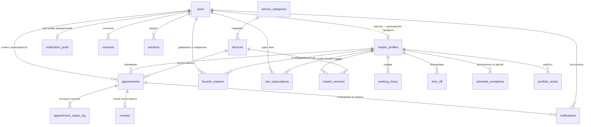

# Схема базы данных сервиса «Варвара»

Документ описывает, какие таблицы нужны сервису онлайн-записи ногтевой студии «Варвара», какие в них поля и как они связаны. Схема выведена из экранов прототипа и карты связей — ничего «на будущее», только то, что реально показывают или собирают экраны.

**Основание:** карта связей прототипа (`Карта связей.dc.html`) и исходники семи страниц — `Варвара - Сайт.dc.html`, `Вход.dc.html`, `Кабинет.dc.html`, `Клиент.dc.html`, `Админ-панель.dc.html`, `Варианты.dc.html`, а также данные-заглушки `assets/varvara-data.js` и `assets/varvara-admin-data.js`.

**СУБД:** PostgreSQL 16. Выбор не косметический — на нём держится главное ограничение схемы (запрет пересечения записей у одного мастера), см. раздел «Спорные решения».

**Статус:** проект схемы. Миграций и кода на этом этапе нет.

---

## 1. Экраны и данные

### Страница 1. Сайт студии — лендинг

| Блок | Что видно на экране | Откуда данные |
|---|---|---|
| Шапка | Логотип, меню, кнопки «Войти» и «Записаться» | статика |
| Первый экран | Заголовок, адрес, фото студии, средняя оценка «4.9 · 265 отзывов» | `studio_settings`, `content_blocks`, агрегат `reviews` |
| Почему мы | Четыре пункта с иконками: стерильность, честное время, запись в Telegram, свои материалы | `content_blocks` |
| Услуги | Фильтр категорий, карточки: название, описание, длительность, цена, «от», бейдж «хит» | `services`, `service_categories` |
| Мастера | Имя, специализация, рейтинг, число отзывов | `users`, `master_profiles`, категории из `master_services`, агрегат `reviews` |
| Работы | Галерея работ с подписями | `portfolio_works` |
| Футер | Адрес, часы работы, телефон, бот, почта | `studio_settings`, `working_hours` |

### Страница 1а. Модалка записи — четыре шага

| Шаг | Что видно | Откуда данные |
|---|---|---|
| Услуга и мастер | Карточки услуг, чипы мастеров + «Любой свободный» | `services`, `master_services` |
| Дата и время | Лента дат со счётчиком свободных окон, слоты по группам утро/день/вечер, занятые перечёркнуты | **вычисляется** (раздел 5) |
| Контакты | Имя, телефон, комментарий, чекбокс согласия на обработку данных | пишет `users`, `consents` |
| Подтверждено | Карточка записи, «Запись №1042» | пишет `appointments` |

Карта связей фиксирует: **записаться можно без входа**. Значит клиент создаётся по имени и телефону, без пароля.

### Страница 2. Вход

Выбор роли (клиент · мастер · администратор), логин (телефон у клиента, email у мастера и админа), пароль. Данные: `users` — `role`, `phone`, `email`, `password_hash`. Успешный вход открывает сеанс в `sessions`; ссылка «Выйти» в шапке кабинета его закрывает.

### Страница 3. Кабинет клиента (сайт)

| Вкладка | Что видно | Откуда данные |
|---|---|---|
| Мои записи | Ближайшие и история: когда, услуга, мастер, цена, адрес, статус; кнопки «Перенести», «Отменить», «Повторить» | `appointments` + `services` + `users` |
| Профиль | Имя, аватар, телефон, три переключателя уведомлений, адрес студии, любимые мастера | `users`, `notification_prefs`, `slot_subscriptions`, `studio_settings`, `favorite_masters` |

Переключатель подписан «Новые окна **у Варвары**» — то есть подписка всегда на конкретного мастера, а не на студию целиком. Это отдельная таблица `slot_subscriptions`, а не флажок.

### Страница 4. Мини-апп клиента (Telegram)

Тот же клиент с телефона: таб-бар «Записаться» / «Мои записи» (с бейджем-счётчиком) / «Профиль». Шаги записи — услуга → мастер → время → шторка проверки → готово. Данные те же, что у страниц 1а и 3, плюс `users.telegram_user_id` — чтобы бот знал, кому писать.

### Страница 5. Админ-панель и кабинет мастера

| Раздел | Что видно | Откуда данные |
|---|---|---|
| Расписание | KPI дня: записей, ожидаемая выручка, ждут подтверждения, свободных окон. Сетка 10:00–21:00 по колонке на мастера, блоки записей окрашены по статусу | `appointments`, `working_hours`, `time_off` |
| Записи | Таблица: когда, клиент + телефон, услуга, мастер, сумма, источник, статус, кнопка «Подтвердить». Фильтры по статусу, поиск по имени и телефону | `appointments`, `users`, `services` |
| Услуги | Прайс с переключателем видимости, форма новой услуги: название, длительность, цена, категория, «Показывать в онлайн-записи» | `services`, `service_categories` |
| Настройки | Онлайн-запись вкл/выкл, ручное подтверждение, напоминание за 2 часа, уведомлять о новых записях, часы работы Пн–Сб и Вс, карточка бота «@varvara_nails_bot · подключён» | `studio_settings`, `working_hours` |

Мастер заходит в ту же панель, но видит только свой столбец расписания и свои записи; «Услуги» и «Настройки» ей недоступны. Это правило прав доступа, отдельных таблиц не требует — фильтр по `appointments.master_id` и проверка `users.role`.

### Страница 6. Варианты компонентов

Справочная страница вне флоу. Для схемы даёт одно: **ровно четыре статуса записи** — `confirmed`, `pending`, `cancelled`, `done`.

---

## 2. Список таблиц

| № | Таблица | Назначение |
|---|---|---|
| 1 | `users` | Люди сервиса: клиенты, мастера, администраторы. Вход и контакты |
| 2 | `master_profiles` | Витринные данные мастера: специализация, фото, участие в онлайн-записи |
| 3 | `service_categories` | Категории прайса: Маникюр, Педикюр, Наращивание, Дизайн |
| 4 | `services` | Прайс: название, длительность, цена, видимость |
| 5 | `master_services` | Какая мастер какие услуги делает, с личной ценой и длительностью |
| 6 | `studio_settings` | Одна строка настроек студии: адрес, часовой пояс, правила записи, бот |
| 7 | `working_hours` | Регулярный недельный график работы студии и мастеров |
| 8 | `time_off` | Разовые блокировки времени: отпуск, перерыв, больничный |
| 9 | `appointments` | Записи клиентов — центральная таблица |
| 10 | `appointment_status_log` | История смены статусов: кто, когда, из какого в какой |
| 11 | `consents` | Согласия на обработку персональных данных и на рассылки |
| 12 | `notification_prefs` | Три переключателя уведомлений в профиле клиента |
| 13 | `notifications` | Очередь и журнал сообщений: подтверждения, напоминания |
| 14 | `reviews` | Оценки и отзывы после визита — источник рейтинга мастера |
| 15 | `favorite_masters` | Любимые мастера клиента |
| 16 | `portfolio_works` | Работы для галереи на лендинге |
| 17 | `sessions` | Открытые сеансы входа: что стоит за экраном «Вход» и ссылкой «Выйти» |
| 18 | `slot_subscriptions` | Подписки «Новые окна у Варвары» — на конкретного мастера |
| 19 | `content_blocks` | Редактируемые блоки лендинга: преимущества студии и фото на первом экране |
| 20 | `schedule_exceptions` | График на конкретную дату: праздник, разовая смена, нерабочий день |

Плюс четыре перечисления: `user_role`, `appointment_status`, `booking_source`, `notification_kind`.

---

## 3. Связи



---

## 4. Таблицы подробно

Обозначения: **PK** — первичный ключ, **FK** — внешний ключ, **U** — уникальное значение. «Обяз.» — поле не может быть пустым (`NOT NULL`).

### 4.1 `users` — люди сервиса

Одна таблица на всех: клиенток, мастеров и администраторов. Роль определяет, что человек видит после входа.

| Поле | Тип | Обяз. | Ключ | Описание |
|---|---|---|---|---|
| `id` | `bigint identity` | да | PK | |
| `role` | `user_role` | да | | `client` · `master` · `admin` |
| `full_name` | `text` | да | | «Марина», «Варвара» |
| `photo_url` | `text` | нет | | Аватар. Пустой — интерфейс рисует кружок с инициалом, как в прототипе |
| `phone` | `text` | нет | U | В формате E.164: `+79210000000` |
| `email` | `citext` | нет | U | Логин мастера и админа |
| `password_hash` | `text` | нет | | **Только хеш** (Argon2id). Пустой у клиентов, записавшихся без регистрации |
| `telegram_user_id` | `bigint` | нет | U | Кому бот шлёт подтверждения |
| `telegram_username` | `text` | нет | | Для поиска в админке |
| `is_active` | `boolean` | да | | `false` — доступ закрыт, данные сохранены |
| `created_at` | `timestamptz` | да | | |
| `updated_at` | `timestamptz` | да | | |

Проверки на уровне таблицы:

- `CHECK (role <> 'client' OR phone IS NOT NULL)` — клиента невозможно создать без телефона: иначе некому звонить и не с чем связать повторный визит.
- `CHECK (role = 'client' OR (email IS NOT NULL AND password_hash IS NOT NULL))` — мастер и админ обязаны иметь логин и пароль, вход по телефону им экран «Вход» не предлагает.
- `CHECK (phone IS NULL OR phone ~ '^\+[1-9][0-9]{7,14}$')` — телефон хранится в одном виде, иначе поиск в админке не найдёт клиентку по номеру.

Пароль в открытом виде не хранится нигде и ни в каком поле. При входе сравнивается хеш от введённого пароля с `password_hash`.

### 4.2 `master_profiles` — витрина мастера

Расширение `users` для роли `master`: то, что видно клиентке на лендинге и в шаге выбора мастера.

| Поле | Тип | Обяз. | Ключ | Описание |
|---|---|---|---|---|
| `user_id` | `bigint` | да | PK, FK → `users.id` | Один профиль на одного пользователя |
| `bio` | `text` | нет | | |
| `photo_url` | `text` | нет | | |
| `accepts_online_booking` | `boolean` | да | | `false` — мастер не появляется в онлайн-записи, но продолжает работать в панели |
| `uses_studio_hours` | `boolean` | да | | `true` — мастер работает по часам студии, своих строк в `working_hours` нет. `false` — график только свой, и день без строки означает выходной |
| `sort_order` | `integer` | да | | Порядок карточек на лендинге |
| `created_at` | `timestamptz` | да | | |
| `updated_at` | `timestamptz` | да | | |

Рейтинг (`4.9`) и число отзывов (`128`) в таблице **не хранятся** — считаются из `reviews`. Подпись на карточке («Маникюр, наращивание, дизайн») тоже не хранится: это категории услуг, которые мастер делает, собранные из `master_services` через `services.category_id`. Отдельное текстовое поле рядом со списком услуг разошлось бы с ним при первой же правке прайса.

### 4.3 `service_categories` — категории прайса

Чипы фильтра «Маникюр · Педикюр · Наращивание · Дизайн» на лендинге и в мини-аппе.

| Поле | Тип | Обяз. | Ключ | Описание |
|---|---|---|---|---|
| `id` | `smallint identity` | да | PK | |
| `slug` | `text` | да | U | `manicure`, `pedicure` — для ссылок и фильтра |
| `title` | `text` | да | | «Маникюр» |
| `sort_order` | `smallint` | да | | |
| `created_at` | `timestamptz` | да | | |

### 4.4 `services` — прайс

| Поле | Тип | Обяз. | Ключ | Описание |
|---|---|---|---|---|
| `id` | `bigint identity` | да | PK | |
| `category_id` | `smallint` | да | FK → `service_categories.id` | |
| `slug` | `text` | да | U | `man-cover`, `ext` |
| `title` | `text` | да | | «Маникюр с покрытием» |
| `description` | `text` | нет | | «Аппаратный, гель-лак» |
| `duration_min` | `integer` | да | | Длительность в минутах: `90`. `CHECK (duration_min > 0 AND duration_min % 5 = 0)` |
| `duration_is_from` | `boolean` | да | | `true` — на карточке «от 20 мин», как у дизайна ногтей. Отдельный флаг от `price_is_from`: у наращивания цена «от», а длительность точная |
| `buffer_after_min` | `integer` | да | | Время на уборку и дезинфекцию после услуги. В расчёте окон занимает место наравне с самой услугой, но клиентке не показывается. `CHECK (buffer_after_min >= 0)` |
| `price_kopecks` | `integer` | да | | Цена в копейках: `320000` = 3 200 ₽. `CHECK (price_kopecks >= 0)` |
| `price_is_from` | `boolean` | да | | `true` — на карточке пишем «от 5 500 ₽» |
| `badge` | `text` | нет | | «хит» |
| `is_active` | `boolean` | да | | Переключатель в разделе «Услуги» |
| `is_online_bookable` | `boolean` | да | | Чекбокс «Показывать в онлайн-записи» |
| `sort_order` | `integer` | да | | |
| `created_at` | `timestamptz` | да | | |
| `updated_at` | `timestamptz` | да | | |

Два флага, а не один: услугу «Ремонт ногтя» мастер делает и пробивает вручную, но в онлайн-запись её не пускают. `is_active = false` убирает услугу отовсюду.

### 4.5 `master_services` — кто что делает

Из карты связей: «У каждой — своя специализация». Лена не берёт наращивание, Ая не делает педикюр — при выборе «Наращивание» в списке мастеров не должно быть Лены.

| Поле | Тип | Обяз. | Ключ | Описание |
|---|---|---|---|---|
| `master_id` | `bigint` | да | PK, FK → `master_profiles.user_id` | |
| `service_id` | `bigint` | да | PK, FK → `services.id` | |
| `duration_min_override` | `integer` | нет | | Своя длительность: у новенькой наращивание идёт 3.5 часа |
| `price_kopecks_override` | `integer` | нет | | Своя цена |
| `is_active` | `boolean` | да | | Временно не берёт эту услугу |
| `created_at` | `timestamptz` | да | | |

Первичный ключ составной — пара «мастер + услуга».

### 4.6 `studio_settings` — настройки студии

Ровно одна строка. Питает футер лендинга, карточку адреса в профиле и весь раздел «Настройки» в админке.

| Поле | Тип | Обяз. | Ключ | Описание |
|---|---|---|---|---|
| `id` | `smallint` | да | PK | `CHECK (id = 1)` — вторую строку создать нельзя |
| `title` | `text` | да | | «Варвара» |
| `city` | `text` | да | | «Санкт-Петербург» |
| `address_line` | `text` | да | | «ул. Рубинштейна, 24» |
| `address_note` | `text` | нет | | «Второй этаж, домофон 24» |
| `timezone` | `text` | да | | `Europe/Moscow` — см. раздел 6 |
| `phone` | `text` | да | | |
| `email` | `text` | нет | | |
| `telegram_bot_username` | `text` | нет | | `varvara_nails_bot` |
| `bot_status` | `text` | да | | `connected` · `disconnected` · `error`. Карточка «Бот записи» показывает «подключён» — это состояние нужно откуда-то брать |
| `bot_connected_at` | `timestamptz` | нет | | Когда бота подключили |
| `owner_user_id` | `bigint` | нет | FK → `users.id` | Кому слать «Уведомлять о новых записях». Без этого поля адресат уведомления не определён |
| `online_booking_enabled` | `boolean` | да | | «Онлайн-запись включена» |
| `manual_confirmation_required` | `boolean` | да | | «Подтверждать записи вручную»: новая запись приходит со статусом `pending` |
| `reminder_lead_min` | `integer` | да | | «Напоминание за 2 часа» = `120` |
| `notify_owner_on_new_booking` | `boolean` | да | | Сообщение владелице в Telegram |
| `free_cancellation_lead_min` | `integer` | да | | «Отмена и перенос бесплатны за 4 часа» = `240` |
| `booking_horizon_days` | `integer` | да | | На сколько дней вперёд открыта запись — верхняя граница расчёта окон |
| `min_lead_time_min` | `integer` | да | | Нижняя граница: за сколько минут до начала ещё можно записаться. Без неё «сегодня 17:58» остаётся доступным окном на 18:00 |
| `pending_ttl_min` | `integer` | да | | Сколько минут неподтверждённая запись держит время. По истечении переходит в `cancelled`, и окно возвращается в расчёт |
| `slot_step_min` | `integer` | да | | Шаг сетки времени: `30` |
| `updated_at` | `timestamptz` | да | | |

### 4.7 `working_hours` — регулярный график

Недельное правило: «Пн–Сб 10:00–21:00, воскресенье выходной». Строка на день недели. Несколько строк на один день — это перерыв посреди дня (10:00–14:00 и 15:00–21:00).

| Поле | Тип | Обяз. | Ключ | Описание |
|---|---|---|---|---|
| `id` | `bigint identity` | да | PK | |
| `master_id` | `bigint` | нет | FK → `master_profiles.user_id` | `NULL` — график всей студии |
| `weekday` | `smallint` | да | | `1` = понедельник … `7` = воскресенье (ISO-8601). `CHECK (weekday BETWEEN 1 AND 7)` |
| `starts_at_local` | `time` | да | | `10:00` — по часам студии, без часового пояса |
| `ends_at_local` | `time` | да | | `21:00`. `CHECK (ends_at_local > starts_at_local)` |
| `valid_from` | `date` | да | | С какой даты действует правило |
| `valid_to` | `date` | нет | | `NULL` — бессрочно. `CHECK (valid_to IS NULL OR valid_to >= valid_from)` |
| `created_at` | `timestamptz` | да | | |

Выходной — это отсутствие строки на нужный день недели, а не строка с нулевой длительностью. `valid_from` / `valid_to` позволяют поменять график с первого числа, не ломая расчёт свободного времени в уже прошедших датах.

Чей график брать, решает `master_profiles.uses_studio_hours`, а не наличие строк: иначе день без строки у мастера читался бы двояко — то ли выходной, то ли «как у студии».

### 4.8 `time_off` — блокировки времени

Разовые исключения из графика: отпуск, обед, задержка, санитарный день. Именно они, а не удаление слотов, закрывают время в онлайн-записи.

| Поле | Тип | Обяз. | Ключ | Описание |
|---|---|---|---|---|
| `id` | `bigint identity` | да | PK | |
| `master_id` | `bigint` | нет | FK → `master_profiles.user_id` | `NULL` — студия закрыта целиком (праздник) |
| `starts_at` | `timestamptz` | да | | |
| `ends_at` | `timestamptz` | да | | `CHECK (ends_at > starts_at)` |
| `kind` | `text` | да | | `vacation` · `break` · `sick` · `holiday` · `other` |
| `reason` | `text` | нет | | Комментарий для панели |
| `created_by_id` | `bigint` | нет | FK → `users.id` | Кто поставил блокировку |
| `created_at` | `timestamptz` | да | | |

### 4.9 `appointments` — записи

Центральная таблица. Питает «Мои записи» у клиентки, сетку расписания и таблицу записей в админке.

| Поле | Тип | Обяз. | Ключ | Описание |
|---|---|---|---|---|
| `id` | `bigint identity` | да | PK | Внутренний ключ |
| `public_number` | `bigint` | да | U | Номер для человека: «Запись №1042». Отдельная последовательность |
| `client_id` | `bigint` | да | FK → `users.id` | |
| `master_id` | `bigint` | да | FK → `master_profiles.user_id` | «Любой свободный» превращается в конкретного мастера при создании |
| `service_id` | `bigint` | да | FK → `services.id` | |
| `starts_at` | `timestamptz` | да | | Начало визита |
| `duration_min` | `integer` | да | | **Снимок** длительности на момент записи |
| `ends_at` | `timestamptz` | да | | Вычисляемое поле: `starts_at + duration_min * interval '1 minute'` |
| `price_kopecks` | `integer` | да | | **Снимок** цены на момент записи |
| `status` | `appointment_status` | да | | `pending` · `confirmed` · `done` · `cancelled` |
| `source` | `booking_source` | да | | `site` · `telegram` · `admin` — колонка «Источник» в таблице записей |
| `client_comment` | `text` | нет | | «Пожелания к дизайну, аллергии, всё важное» |
| `master_note` | `text` | нет | | Внутренняя заметка, клиентке не видна |
| `rescheduled_from_id` | `bigint` | нет | FK → `appointments.id` | Ссылка на перенесённую запись |
| `created_at` | `timestamptz` | да | | |
| `updated_at` | `timestamptz` | да | | |

Проверки:

- `CHECK (duration_min > 0 AND price_kopecks >= 0)`.

Кто, когда и почему отменил запись, в этой таблице **не хранится** — только текущий статус. Отмена это смена статуса, а смены статусов целиком лежат в `appointment_status_log`: там уже есть и время (`changed_at`), и автор (`changed_by_id`), и причина (`comment`). Три поля рядом со статусом были бы вторым экземпляром той же записи в журнале, который рано или поздно с ним разойдётся.

**Почему цена и длительность продублированы из `services`.** Прайс меняется. Если в марте маникюр стоил 3 200 ₽, а в апреле стал 3 600 ₽, то январская история в кабинете клиентки не должна задним числом подорожать, а отчёт по выручке за март — вырасти сам собой. Поэтому в момент создания записи цена и длительность копируются в запись и дальше живут своей жизнью.

### 4.10 `appointment_status_log` — история статусов

Кто подтвердил запись, кто отменил и когда. Нужна для разбора спорных ситуаций и для честной статистики отмен.

| Поле | Тип | Обяз. | Ключ | Описание |
|---|---|---|---|---|
| `id` | `bigint identity` | да | PK | |
| `appointment_id` | `bigint` | да | FK → `appointments.id` | |
| `from_status` | `appointment_status` | нет | | `NULL` при создании записи |
| `to_status` | `appointment_status` | да | | |
| `changed_by_id` | `bigint` | нет | FK → `users.id` | `NULL` — сменил автомат (например, `confirmed` → `done` по прошествии визита) |
| `comment` | `text` | нет | | |
| `changed_at` | `timestamptz` | да | | |

### 4.11 `consents` — согласия

Чекбокс «Согласна на обработку персональных данных» на шаге контактов. Хранится как отдельное событие с датой и версией документа — этого требует 152-ФЗ, и по одному булеву флажку в профиле доказать согласие невозможно.

| Поле | Тип | Обяз. | Ключ | Описание |
|---|---|---|---|---|
| `id` | `bigint identity` | да | PK | |
| `user_id` | `bigint` | да | FK → `users.id` | |
| `kind` | `text` | да | | `personal_data` · `marketing` |
| `is_granted` | `boolean` | да | | `false` — отзыв согласия |
| `document_version` | `text` | нет | | Версия текста политики |
| `source` | `booking_source` | нет | | Где нажали галочку |
| `changed_at` | `timestamptz` | да | | |

### 4.12 `notification_prefs` — переключатели уведомлений

Три тумблера в профиле клиентки, на сайте и в мини-аппе.

| Поле | Тип | Обяз. | Ключ | Описание |
|---|---|---|---|---|
| `user_id` | `bigint` | да | PK, FK → `users.id` | |
| `telegram_reminders` | `boolean` | да | | «Напоминать в Telegram» |
| `marketing` | `boolean` | да | | «Акции и новинки» |
| `updated_at` | `timestamptz` | да | | |

Третий переключатель профиля — «Новые окна у Варвары» — здесь отсутствует намеренно: его состояние это наличие активной строки в `slot_subscriptions`. Флаг рядом с подпиской был бы вторым выключателем той же лампы, и при расхождении неясно, какой из них главный.

### 4.13 `notifications` — очередь и журнал сообщений

Напоминание за два часа нужно кому-то поставить в очередь, отправить один раз и отменить, если визит отменили.

| Поле | Тип | Обяз. | Ключ | Описание |
|---|---|---|---|---|
| `id` | `bigint identity` | да | PK | |
| `user_id` | `bigint` | да | FK → `users.id` | Получатель |
| `appointment_id` | `bigint` | нет | FK → `appointments.id` | `NULL` у рассылок |
| `kind` | `notification_kind` | да | | `booking_created` · `booking_confirmed` · `reminder` · `cancelled` · `new_slot` · `marketing` |
| `channel` | `text` | да | | `telegram` · `sms` · `email` |
| `scheduled_at` | `timestamptz` | да | | Когда отправить |
| `sent_at` | `timestamptz` | нет | | Когда отправлено фактически |
| `status` | `text` | да | | `scheduled` · `sent` · `failed` · `cancelled` |
| `error` | `text` | нет | | Текст ошибки доставки |
| `created_at` | `timestamptz` | да | | |

### 4.14 `reviews` — оценки и отзывы

Источник «4.9 · 128 отзывов» на карточке мастера и «4.9 · 265» на лендинге.

| Поле | Тип | Обяз. | Ключ | Описание |
|---|---|---|---|---|
| `id` | `bigint identity` | да | PK | |
| `appointment_id` | `bigint` | да | U, FK → `appointments.id` | Единственная связь: и автор, и мастер берутся из самой записи |
| `rating` | `smallint` | да | | `CHECK (rating BETWEEN 1 AND 5)` |
| `text` | `text` | нет | | |
| `is_published` | `boolean` | да | | Модерация перед показом на лендинге |
| `created_at` | `timestamptz` | да | | |

Кто оставил отзыв и о ком он — определяется записью: `appointments.client_id` и `appointments.master_id`. Своих копий этих полей у отзыва нет. Иначе перенос визита к другому мастеру оставил бы отзыв висеть на прежнем, и рейтинг посчитался бы не тому человеку.

### 4.15 `favorite_masters` — избранное

Блок «Любимые мастера» в профиле и чип «в избранном».

| Поле | Тип | Обяз. | Ключ | Описание |
|---|---|---|---|---|
| `client_id` | `bigint` | да | PK, FK → `users.id` | |
| `master_id` | `bigint` | да | PK, FK → `master_profiles.user_id` | |
| `created_at` | `timestamptz` | да | | |

### 4.16 `portfolio_works` — галерея работ

Блок «Работы» на лендинге: «Нюд с втиркой», «Френч», «Наращивание, форма миндаль».

| Поле | Тип | Обяз. | Ключ | Описание |
|---|---|---|---|---|
| `id` | `bigint identity` | да | PK | |
| `master_id` | `bigint` | нет | FK → `master_profiles.user_id` | Чья работа |
| `service_id` | `bigint` | нет | FK → `services.id` | Что делали |
| `image_url` | `text` | да | | |
| `title` | `text` | нет | | Подпись под фото |
| `sort_order` | `integer` | да | | |
| `is_published` | `boolean` | да | | |
| `created_at` | `timestamptz` | да | | |

### 4.17 `sessions` — сеансы входа

Экран «Вход» в карте связей есть, а хранить результат входа было негде. Сеанс нужен, чтобы «Выйти» в шапке кабинета действительно закрывало доступ, а мастер не оставался залогиненным на общем компьютере студии.

| Поле | Тип | Обяз. | Ключ | Описание |
|---|---|---|---|---|
| `id` | `bigint identity` | да | PK | |
| `user_id` | `bigint` | да | FK → `users.id` | |
| `token_hash` | `text` | да | U | **Только хеш** токена, как и с паролем. Утечка базы не даёт войти под чужим сеансом |
| `issued_at` | `timestamptz` | да | | |
| `expires_at` | `timestamptz` | да | | `CHECK (expires_at > issued_at)` |
| `revoked_at` | `timestamptz` | нет | | Заполняется при нажатии «Выйти» |
| `user_agent` | `text` | нет | | Устройство — чтобы человек узнал свой сеанс в списке |
| `ip` | `inet` | нет | | |

Сеанс из мини-аппа Telegram живёт по тем же правилам: бот подтверждает личность, сервис открывает сеанс.

### 4.18 `slot_subscriptions` — подписка на свободные окна

Переключатель в профиле называется «Новые окна **у Варвары**» — подписка всегда на конкретного мастера. Булев флажок в `notification_prefs` на такое не отвечает: он не хранит, чьи именно окна ждут.

| Поле | Тип | Обяз. | Ключ | Описание |
|---|---|---|---|---|
| `id` | `bigint identity` | да | PK | |
| `client_id` | `bigint` | да | FK → `users.id` | |
| `master_id` | `bigint` | да | FK → `master_profiles.user_id` | Чьи окна ждём |
| `service_id` | `bigint` | нет | FK → `services.id` | `NULL` — любая услуга этого мастера |
| `date_from` | `date` | нет | | Интересующий диапазон дат |
| `date_to` | `date` | нет | | `CHECK (date_to IS NULL OR date_from IS NULL OR date_to >= date_from)` |
| `is_active` | `boolean` | да | | Переключатель в профиле |
| `notified_at` | `timestamptz` | нет | | Когда в последний раз сообщили об окне — чтобы не слать по десять раз в день |
| `created_at` | `timestamptz` | да | | |

Когда запись отменяют, освободившееся время сверяется с активными подписками, и подходящим клиентам ставится сообщение `new_slot` в `notifications`.

### 4.19 `content_blocks` — редактируемые блоки лендинга

Четыре пункта «Стерильность · Честное время · Запись в Telegram · Свои материалы» и фото на первом экране — это содержимое сайта, а не оформление. В прототипе оно записано прямо в вёрстке; чтобы владелица могла поправить текст сама, ему нужно место в базе.

| Поле | Тип | Обяз. | Ключ | Описание |
|---|---|---|---|---|
| `id` | `bigint identity` | да | PK | |
| `slug` | `text` | да | U | `hero_photo`, `highlight_sterility` |
| `section` | `text` | да | | `hero` · `highlights` · `about` |
| `icon` | `text` | нет | | Имя иконки: `shield-check`, `clock` |
| `title` | `text` | нет | | «Стерильность» |
| `body` | `text` | нет | | «Автоклав, одноразовые файлы, всё вскрываем при вас» |
| `image_url` | `text` | нет | | Фото студии на первом экране |
| `sort_order` | `integer` | да | | |
| `is_published` | `boolean` | да | | |
| `updated_at` | `timestamptz` | да | | |

### 4.20 `schedule_exceptions` — график на конкретную дату

Недельное правило отвечает на вопрос «как обычно», но не на вопрос «как 8 марта». Эта таблица заменяет правило на одну календарную дату — и в сторону закрытия, и в сторону открытия.

| Поле | Тип | Обяз. | Ключ | Описание |
|---|---|---|---|---|
| `id` | `bigint identity` | да | PK | |
| `master_id` | `bigint` | нет | FK → `master_profiles.user_id` | `NULL` — исключение для всей студии |
| `exception_date` | `date` | да | | Дата по календарю студии |
| `is_working` | `boolean` | да | | `false` — в этот день не работаем вовсе |
| `starts_at_local` | `time` | нет | | Заполняется при `is_working = true`: «в эту субботу с 12:00» |
| `ends_at_local` | `time` | нет | | `CHECK (ends_at_local > starts_at_local)` |
| `reason` | `text` | нет | | «Праздник», «Выездной день», «Разовая смена» |
| `created_by_id` | `bigint` | нет | FK → `users.id` | |
| `created_at` | `timestamptz` | да | | |

Проверка: `CHECK (is_working = false OR (starts_at_local IS NOT NULL AND ends_at_local IS NOT NULL))` — рабочий день-исключение обязан назвать часы, иначе непонятно, что именно открылось.

**Чем отличается от `time_off`.** Исключение **заменяет** недельное правило на дату целиком: воскресенье-рабочее или пятница-нерабочая. Блокировка **вычитает** кусок внутри уже определённого рабочего дня: обед с 14:00 до 15:00, отпуск с 1 по 14 июля. Без исключений открыть нерабочий день невозможно в принципе — `time_off` умеет только отнимать.

---

## 5. Как считается свободное время

**Таблицы слотов в схеме нет.** Заранее нарезанные окна пришлось бы плодить на месяцы вперёд, пересоздавать при каждом изменении графика и синхронизировать с записями — а любой сбой синхронизации выдаёт клиентке окно, которое уже занято.

Единственная таблица со словом «slot» в названии — `slot_subscriptions`. Она хранит подписки клиентов на освободившиеся окна конкретного мастера, а не сами окна: строка появляется, когда клиентка включает «Новые окна у Варвары», и не зависит от того, свободно сейчас время или нет.

### Что нужно для расчёта

| Вход | Где лежит |
|---|---|
| График мастера | `working_hours` + `master_profiles.uses_studio_hours` + `schedule_exceptions` |
| Длительность услуги | `master_services.duration_min_override`, иначе `services.duration_min`; плюс `services.buffer_after_min` |
| Записи с началом и окончанием | `appointments.starts_at`, `appointments.ends_at`, `appointments.status` |
| Блокировки времени | `time_off` |
| Границы и шаг | `studio_settings`: `timezone`, `slot_step_min`, `min_lead_time_min`, `booking_horizon_days`, `pending_ttl_min` |

### Алгоритм

Свободное время вычисляется в момент запроса. Для пары «мастер + дата» и выбранной услуги:

1. **Определить календарный день.** Дата переводится в границы суток по `studio_settings.timezone`, от них берётся день недели по ISO-8601. Считать день недели по UTC нельзя: для визита в 00:30 это был бы уже другой день.
2. **Взять рабочие интервалы.** Если на эту дату есть строка в `schedule_exceptions` — она заменяет недельное правило целиком: при `is_working = false` расчёт закончен, окон нет. Студийное исключение (`master_id IS NULL`) сильнее личного: если студия закрыта на праздник, личная «разовая смена» мастера не открывает день — в закрытое помещение клиентку не позвать. Если исключений нет, берутся строки `working_hours` на нужный день недели, где дата попадает в `valid_from … valid_to`: у мастера свои, а при `uses_studio_hours = true` — студийные. Отсутствие строк означает выходной.
3. **Вычесть блокировки.** Все пересекающиеся интервалы из `time_off` — и личные, и общестудийные.
4. **Вычесть занятое.** Записи этого мастера со статусом `pending` или `confirmed`, пересекающие день, — от `starts_at` до `ends_at`. Отменённые (`cancelled`) время не занимают, завершённые (`done`) — занимают, они в прошлом. Неподтверждённая запись держит время не бесконечно: спустя `pending_ttl_min` от `created_at` она переходит в `cancelled`, и окно возвращается в расчёт. Без этого правила брошенная заявка, которую владелица не подтвердила, закрывала бы окно навсегда.
5. **Посчитать нужную длину.** `duration_min` из `master_services`, если у мастера своя, иначе из `services`; сверху `services.buffer_after_min`. Именно эта сумма должна поместиться в свободный кусок — иначе следующая клиентка сядет в неубранное кресло.
6. **Нарезать остаток шагом `slot_step_min`** и оставить те точки старта, от которых сумма из шага 5 укладывается в свободный кусок целиком, не выходя за конец рабочего интервала.
7. **Отсечь границы.** Слишком близкие окна — ближе `min_lead_time_min` от текущего момента — и даты дальше `booking_horizon_days`. Прошедшее время отсекается этим же условием.

Шаги 6 и 7 — правила витрины, а не физики расписания: они решают, что показать клиентке в онлайн-записи. Администратор в панели записывает вручную и мимо них — «сейчас пришла, посадим прямо сейчас» должно работать. Незыблемы только шаги 2–5: за их пределами записи не существует, иначе она встанет вне рабочего дня или поверх чужой.

### Пример: Варвара, суббота 15 августа, «Маникюр с покрытием»

Рабочий интервал 10:00–21:00, исключений на дату нет. Записи: 10:00–11:30, 12:00–15:00 и 18:00–19:30. Блокировок нет. Услуга 90 минут плюс 15 минут на уборку — нужен свободный кусок в 105 минут.

Остаются куски 11:30–12:00 (30 мин — мало), 15:00–18:00 (180 мин) и 19:30–21:00 (90 мин — мало). Из среднего куска с шагом 30 минут выходят старты 15:00, 15:30 и 16:00: от 16:30 услуга с уборкой уже не помещается до 18:00. Итого три окна — это и есть число на ленте дат.

Счётчик «свободных окон» на ленте дат — количество точек из шага 5. KPI «4 свободных окна» в админке — то же самое по всем мастерам за день.

Для «Любого свободного мастера» расчёт повторяется по всем мастерам с `accepts_online_booking = true`, умеющим эту услугу, и результаты объединяются; при записи выбирается конкретный мастер.

Всё это опирается на индексы из раздела 7 — без них шаг 3 будет перечитывать всю таблицу записей на каждое открытие календаря.

---

## 6. Формат дат и времени

В схеме используются **три разных типа**, и это не небрежность — они отвечают на разные вопросы.

| Тип | Где | Что означает |
|---|---|---|
| `timestamptz` | `starts_at`, `created_at`, `sent_at`, `time_off` | Момент на оси времени |
| `time` | `working_hours.starts_at_local` | Показание настенных часов |
| `date` | `working_hours.valid_from` | Календарный день |

**Моменты — в `timestamptz`, значение хранится в UTC.** PostgreSQL переводит входящее значение в UTC при записи и обратно в зону клиента при чтении. Наружу отдаём ISO 8601 с зоной: `2026-08-15T18:00:00+03:00`. Причины:

- Сайт, Telegram-бот и админка — три разных клиента. Если хранить «18:00» без зоны, каждый из них додумает пояс по-своему, и запись расползётся по времени.
- Сравнение моментов, сортировка и проверка пересечений работают корректно только когда все значения приведены к одной шкале.
- В базе один способ хранения — не нужно помнить, в какой колонке «местное», а в какой «серверное».

**График работы — в `time`, без пояса.** «Студия работает с 10:00» — это правило по настенным часам, а не конкретный момент. Если записать его как момент, то при смене часового пояса города или переносе сервера график поедет. Поэтому `working_hours` хранит местное время, а часовой пояс лежит рядом, в `studio_settings.timezone` (`Europe/Moscow`), и применяется при расчёте свободных окон.

**Что это даёт на практике.** Клиентка в отпуске во Владивостоке открывает мини-апп: сервер отдаёт `+03:00`, приложение показывает время студии, а не местное владивостокское. Мастер в панели видит те же 18:00. В базе лежит одно значение `2026-08-15T15:00:00Z`.

Отдельно: все `created_at` / `updated_at` — тоже `timestamptz`, заполняются сервером через `now()`, а не приложением. Часы на клиенте могут врать, и тогда запись «создана» раньше, чем оформлена.

---

## 7. Уникальные ограничения и индексы

### Уникальность

| Ограничение | Зачем | Что сломается без него |
|---|---|---|
| `users.phone` UNIQUE | Один номер — одна клиентка | Марина записывается с сайта, потом из бота — заводятся два профиля. В «Моих записях» видна половина визитов, а мастер в панели видит двух разных Марин с одним телефоном |
| `users.email` UNIQUE | Логин мастера и админа | Два аккаунта на одну почту: непонятно, какой пароль верный и чьи это записи |
| `users.telegram_user_id` UNIQUE | Привязка к боту | Бот не знает, кому слать напоминание, и шлёт одно и то же двум профилям |
| `services.slug` UNIQUE | Стабильная ссылка на услугу | Две услуги с одним `slug` — фильтр категорий и прямая ссылка ведут не туда |
| `master_services (master_id, service_id)` PK | Пара «мастер + услуга» одна | В карточке мастера услуга задваивается, а при выборе цены непонятно, какую из двух строк брать |
| `appointments.public_number` UNIQUE | Номер записи для человека | Клиентка называет «№1042», а таких записей две — администратор отменяет чужую |
| `reviews.appointment_id` UNIQUE | Один визит — один отзыв | Клиентка ставит пять единиц подряд и топит рейтинг мастера |
| `favorite_masters (client_id, master_id)` PK | Мастер в избранном один раз | Список «Любимые мастера» с повторами |
| `notifications (appointment_id, kind, channel)` UNIQUE | Одно сообщение одного типа на запись | Клиентке приходит пять одинаковых напоминаний — жалобы и отписка от бота |
| `working_hours (master_id, weekday, starts_at_local, valid_from)` UNIQUE NULLS NOT DISTINCT | Одно правило на интервал | Дубликат строки удваивает интервал, а «свободных окон» становится вдвое больше, чем есть |
| `schedule_exceptions (master_id, exception_date)` UNIQUE NULLS NOT DISTINCT | Одно исключение на дату | Два исключения на 8 марта — «работаем с 12:00» и «не работаем»; расчёт выберет случайное |
| `sessions.token_hash` UNIQUE | Один токен — один сеанс | Два сеанса с одним токеном: выход на одном устройстве не закрывает второе |
| `slot_subscriptions (client_id, master_id, service_id)` UNIQUE | Одна подписка на пару «клиент + мастер» | Переключатель в профиле дёрнули дважды — клиентке приходит два сообщения об одном и том же окне |
| `content_blocks.slug` UNIQUE | Блок лендинга адресуется по имени | Вёрстка тянет блок по `slug` и получает случайный из двух |
| `studio_settings CHECK (id = 1)` | Настройки в единственном экземпляре | Появляется вторая строка настроек, и сервис работает по случайной из двух |

### Главное ограничение: запрет двойной записи

```sql
ALTER TABLE appointments ADD CONSTRAINT appointments_no_overlap
  EXCLUDE USING gist (
    master_id WITH =,
    tstzrange(starts_at, ends_at) WITH &&
  ) WHERE (status IN ('pending', 'confirmed'));
```

Запрещает существование двух активных записей у одного мастера с пересекающимся временем. Отменённые записи из проверки исключены — освобождённое время должно снова стать доступным.

**Зачем.** Проверка «свободно ли окно» на стороне приложения ненадёжна: две клиентки, нажавшие «Записаться» на одно и то же окно в одну секунду, обе получат «свободно» и обе создадут запись. Ограничение в базе — единственное место, где эту гонку можно поймать гарантированно: вторая транзакция просто не пройдёт.

**Что сломается без него.** В расписании два клиента в одном кресле в 18:00. Разбирать это придётся мастеру, лицом к лицу с клиенткой.

### Индексы

| Индекс | Зачем | Что сломается без него |
|---|---|---|
| `appointments (master_id, starts_at)` | Сетка расписания на день | Экран расписания перечитывает всю таблицу записей за всю историю на каждое открытие |
| `appointments (client_id, starts_at DESC)` | «Мои записи» у клиентки | То же самое при каждом заходе в кабинет и мини-апп |
| `appointments (starts_at) WHERE status IN ('pending','confirmed')` частичный | Расчёт свободных окон (шаг 3 раздела 5) | Календарь открывается всё медленнее по мере роста истории — а он открывается на каждом выборе даты |
| `appointments (status) WHERE status = 'pending'` частичный | KPI «2 ждут подтверждения» и фильтр в таблице | Счётчик на каждой загрузке панели считает по всей таблице |
| `appointments (created_at DESC)` | Лента последних записей в админке | Сортировка таблицы записей идёт по всему объёму |
| `time_off USING gist (master_id, tstzrange(starts_at, ends_at))` | Вычитание блокировок при расчёте окон | Пересечения интервалов ищутся перебором |
| `services (category_id) WHERE is_active` частичный | Фильтр категорий на лендинге | Мелочь на шести услугах, заметно на сотне |
| `reviews (appointment_id) WHERE is_published` частичный | Рейтинг мастера «4.9 · 128» — соединение отзывов с записями, где и лежит мастер | Агрегат перебирает все отзывы студии на каждой отрисовке карточки |
| `users USING gin (full_name gin_trgm_ops)` | Поиск «по имени или телефону» в админке | Поиск по подстроке идёт перебором; на паре сотен клиенток ещё терпимо, дальше — нет |
| `users (phone)` | Тот же поиск по номеру | Уникальный индекс на `phone` эту задачу уже закрывает — отдельный не нужен |
| `notifications (scheduled_at) WHERE status = 'scheduled'` частичный | Отправка напоминаний по расписанию | Фоновая задача каждую минуту перечитывает весь журнал сообщений |
| `portfolio_works (sort_order) WHERE is_published` частичный | Галерея на лендинге | Сортировка по всей таблице, включая скрытые работы |
| `sessions (user_id) WHERE revoked_at IS NULL` частичный | Проверка сеанса на каждом запросе | Самый частый запрос сервиса идёт по всей истории входов |
| `sessions (expires_at)` | Уборка просроченных сеансов | Таблица растёт бесконечно, проверка входа замедляется вместе с ней |
| `slot_subscriptions (master_id) WHERE is_active` частичный | При отмене записи найти, кому предложить окно | Отмена записи перебирает все подписки всех клиентов за всю историю |
| `schedule_exceptions (exception_date)` | Шаг 2 расчёта окон и сетка расписания в панели | Проверка «а нет ли исключения на эту дату» читает всю таблицу — на каждую дату в ленте, то есть по семь раз на открытие календаря |
| `content_blocks (section, sort_order) WHERE is_published` частичный | Сборка лендинга | Мелочь на десяти блоках, но лендинг — самая посещаемая страница |

Частичные индексы (`WHERE …`) выбраны намеренно: они меньше и быстрее обычных, потому что не хранят строки, которые в запросах всё равно не участвуют — например, отменённые записи в расчёте занятости.

Оговорка про `NULLS NOT DISTINCT` в двух ограничениях выше: по умолчанию PostgreSQL считает два `NULL` разными значениями, поэтому обычный `UNIQUE` не помешал бы завести два студийных правила на один и тот же день недели — в обоих `master_id` пуст. Строки с пустым мастером здесь как раз самые важные: это график всей студии.

---

## 8. Спорные решения

**1. Одна таблица `users` вместо `clients` / `masters` / `admins`.**
Экран входа один на три роли, значит логин, пароль и телефон живут в одном месте. Три отдельные таблицы означали бы три реализации входа и невозможность отследить случай, когда мастер записывается как клиентка. Минус решения честный: у клиентов всегда пусты `email` и `password_hash`, у мастеров — часто `telegram_user_id`. Часть пустот закрыта проверками `CHECK`. Витринные поля мастера вынесены в `master_profiles`, чтобы не держать пустые «специализация» и «фото» у каждой клиентки.

**2. `appointments.master_id` ссылается на `master_profiles`, а не на `users`.**
Так база сама запрещает записать клиентку к клиентке: в `master_profiles` есть только те, у кого роль `master`. Цена — лишний JOIN, когда нужно имя мастера. Альтернатива (ссылка на `users` + проверка роли в коде) отдаёт целостность на откуп приложению.

**3. Цена и длительность продублированы в `appointments`.**
Нормализация требует хранить цену только в `services`. Но тогда изменение прайса переписывает историю и отчёты за прошлые месяцы. Выбран снимок значений на момент записи — это не дублирование, а фиксация факта сделки. Точно так же поступают чеки в любой кассовой системе.

**4. Деньги в копейках, целым числом.**
`price_kopecks integer` вместо `numeric(10,2)`. Копейки исключают ошибки округления при подсчёте выручки и не дают случайно завести цену `3200.999`. Цена: при выводе нужно делить на 100, и это легко забыть. `numeric` был бы нагляднее в SQL-консоли, но опаснее в арифметике.

**5. Клиент без пароля.**
Карта связей прямо разрешает записаться без входа, поэтому `password_hash` у клиентов может быть пустым. Обратная сторона: любой, кто знает номер телефона, при следующей записи с сайта попадёт в тот же профиль и увидит имя. Компромисс осознанный — требовать регистрацию до записи означает терять клиенток на первом шаге. Историю визитов и переносы кабинет отдаёт только после входа.

**6. «Любой свободный мастер» превращается в конкретного мастера сразу.**
Альтернатива — `master_id NULL` до подтверждения. Это ломает ключевое ограничение: у записи без мастера нельзя проверить пересечение, и вся защита от двойной записи перестаёт работать. Поэтому «любой свободный» — это правило выбора на стороне приложения, а в базу попадает уже конкретное имя. Клиентке в карточке записи всё равно показывают выбранного мастера.

**7. Четыре статуса, без `no_show`.**
Прототип показывает ровно четыре бейджа, схема повторяет их: `pending`, `confirmed`, `done`, `cancelled`. Пятый напрашивающийся статус — «не пришла» — сознательно не добавлен: на экранах его нет, а вводить значение, которое некому показать и некому проставить, рано. Когда понадобится, это одна строка `ALTER TYPE … ADD VALUE`, и история в `appointment_status_log` не пострадает.

**8. Статусы как тип-перечисление, а не справочная таблица.**
`ENUM` даёт проверку на уровне базы и читаемые значения в запросах. Справочник `appointment_statuses` был бы гибче (можно менять названия и цвета без миграции), но за это пришлось бы платить JOIN в каждом запросе к записям — самом частом запросе сервиса. Набор статусов меняется раз в год, названия для интерфейса всё равно живут в переводах фронтенда.

**9. Рейтинг мастера не хранится.**
`4.9` и `128 отзывов` считаются из `reviews` запросом. Хранимое поле пришлось бы пересчитывать при каждом новом отзыве, при снятии с публикации и при удалении — три места, где легко разойтись с реальностью. Если карточки мастеров станут узким местом, ответ — материализованное представление с обновлением по расписанию, а не колонка, которую правит приложение.

**10. График студии — строки с `master_id IS NULL` в общей таблице.**
Альтернатива — отдельная таблица `studio_hours`. Но правила у них одинаковые (день недели, интервал, срок действия), и расчёт свободного времени вычитал бы одно и то же из двух источников по двум разным веткам кода. Цена решения: `master_id` стал необязательным, и запрос «график Лены» обязан явно учитывать наследование от студии.

**11. PostgreSQL, а не SQLite или MySQL.**
Решающий довод — `EXCLUDE USING gist` для запрета пересечения записей. В MySQL и SQLite такого ограничения нет: защиту от двойной записи пришлось бы собирать на блокировках в приложении, а это ровно тот класс ошибок, который проявляется в пятницу вечером на пике записей. Дополнительно нужны `citext` для регистронезависимой почты, частичные индексы и `gin_trgm_ops` для поиска по имени — всё это в PostgreSQL есть из коробки.

**12. `ends_at` — вычисляемое поле, а не расчёт на лету.**
Хранится как generated column `starts_at + duration_min`. Так конец визита участвует в ограничении на пересечение и в индексах, что при расчёте на лету невозможно. Плата — лишние 8 байт на запись.

**13. Согласия вынесены в отдельную таблицу.**
Проще было бы поставить `consent_given boolean` в `users`. Но согласие — событие с датой и версией документа: важно, на какую редакцию политики человек согласился и когда, и что согласие можно отозвать. Флаг в профиле этого не покажет и в спорной ситуации ничего не докажет.

**14. Сеансы хранятся в базе, а не только в самоподписанном токене.**
Токен без хранения (JWT) не требует таблицы, но его невозможно отозвать до истечения срока: нажатие «Выйти» ничего не закроет, а увольнение мастера оставит ей рабочий доступ. Для студии, где панель открывают с общего компьютера, это важнее экономии на одном запросе к базе. В таблице лежит хеш токена, а не сам токен — по той же причине, по которой не хранится пароль.

**15. Подписка на окна — таблица, а не флажок в настройках уведомлений.**
Соблазнительно оставить `new_slots_alerts boolean` и слать уведомления обо всех окнах студии. Но переключатель в прототипе подписан «Новые окна у Варвары», то есть у конкретного мастера, а клиентки ходят к своей. Флажок не хранит, чьи окна ждут, и рассылка превратится в спам о чужих мастерах. Цена решения: в профиле переключатель теперь отражает состояние строки в `slot_subscriptions`, а не поле в `notification_prefs`, — сам флажок остался как общий рубильник «слать ли такие уведомления вообще».

**16. Тексты лендинга — в базе, а не в вёрстке.**
Четыре пункта про стерильность и честное время сейчас записаны прямо в HTML, и это нормально для прототипа. Но владелица уже управляет прайсом и настройками сама, а поменять слово в обещании клиенту не может без разработчика — разрыв неоправданный. Обратная сторона: появляется таблица, которую надо наполнить до первого запуска, иначе лендинг откроется с пустыми блоками.

**17. Исключения по датам отделены от блокировок времени.**
Можно было обойтись одной таблицей: и отпуск, и праздник — «время, когда не работаем». Но `time_off` умеет только вычитать, а сценарий «в это воскресенье выходим» требует обратного — добавить время в день, которого в недельном правиле нет вовсе. Отсюда разделение: `schedule_exceptions` заменяет правило на дату, `time_off` вычитает куски внутри дня. Цена — два источника вместо одного и обязательный порядок их применения в расчёте: сначала исключение, потом блокировки.

**18. Флаг `uses_studio_hours` вместо правила «нет своих строк — значит студийные».**
Правило по наличию строк выглядит экономнее, но оно двусмысленно ровно там, где ошибка дороже всего: если у Лены есть график на понедельник–среду, а на четверг строки нет — это её выходной или «работает как студия»? Молчаливое наследование в таких случаях открывает запись на день, когда мастера нет на месте. Явный флаг убирает догадку: `false` — считаем только свои строки, отсутствие строки означает выходной.

**19. Подпись мастера собирается из прайса, а не хранится текстом.**
«Маникюр, наращивание, дизайн» на карточке — это категории услуг, которые мастер делает. Отдельное поле дало бы свободу формулировок («Люблю сложный дизайн»), но обязано было бы совпадать с прайсом и при первой же правке разошлось бы с ним. Выбран расчёт из `master_services`. Цена: витрина потеряла в выразительности, зато перестала обещать услуги, которых нет. Если маркетинговая подпись понадобится, её место — отдельное поле рядом с `bio`, а не подмена списка услуг.

**20. Буфер на уборку — свойство услуги, а не общая константа студии.**
После наращивания убирать дольше, чем после ремонта одного ногтя, поэтому единое значение в настройках студии либо завышает простой на коротких услугах, либо занижает на длинных. Обратная сторона: буфер придётся проставить у каждой услуги, и забытый ноль незаметно склеит записи вплотную. Значение по умолчанию `0` выбрано осознанно: оно повторяет сегодняшнее поведение прототипа, где буфера нет вовсе.

---

## 9. Сверка с картой связей

Второй проход по карте связей — по каждому экрану и каждому видимому элементу — показал шесть мест, где интерфейсу нечего было показать или некуда записать. Все шесть закрыты выше.

| Экран | Чего не хватало | Что добавлено |
|---|---|---|
| Лендинг, блок «Почему мы» | Четыре пункта с иконками и фото студии на первом экране жили только в вёрстке | Таблица `content_blocks` |
| Вход, ссылка «Выйти» | Результат входа негде хранить, выход нечем закрыть | Таблица `sessions` |
| Профиль, «Новые окна у Варвары» | Булев флаг не хранит, чьих именно окон ждут | Таблица `slot_subscriptions` |
| Профиль и кабинет, аватар | У клиента не было поля фотографии — только у мастера | Поле `users.photo_url` |
| Услуги, «Дизайн ногтей — от 20 мин» | Флаг «от» был только у цены, а у дизайна плавающая ещё и длительность | Поле `services.duration_is_from` |
| Настройки, карточка «Бот записи» | Надпись «подключён» не из чего было получить, а адресат уведомления о новых записях не определён | Поля `studio_settings.bot_status`, `bot_connected_at`, `owner_user_id` |

Что проверено и **не** потребовало изменений:

- Счётчики свободных окон на ленте дат, бейдж «2» на вкладке «Мои записи», все четыре показателя дня в панели — вычисляются из уже описанных таблиц.
- Группы слотов «Утро · День · Вечер» — это разбиение вычисленных окон по времени суток, а не хранимые категории.
- Четыре миниатюры работ на карточке мастера в мини-аппе — `portfolio_works` с фильтром по мастеру.
- Кнопки «Перенести», «Отменить», «Повторить», «Подтвердить» — покрыты полями `appointments` и записями в `appointment_status_log`.
- Колонка «Источник» и поиск по имени и телефону в панели — `appointments.source` и индексы раздела 7.
- Экраны «Варианты компонентов» и «Карта связей» — справочные, собственных данных не требуют.
- Восстановление пароля — экрана в прототипе нет, таблицу токенов сброса не заводим до появления сценария.

### Проверка расчёта свободных интервалов

Отдельный проход по алгоритму раздела 5: хватает ли данных, чтобы получить свободные интервалы конкретного мастера на конкретный день.

| Что нужно | Было в схеме | Чего не хватало |
|---|---|---|
| График мастера | `working_hours` с недельным правилом и сроком действия | Двух вещей. Первая: правило «чей график брать» опиралось на наличие строк и читалось двояко — день без строки мог означать и выходной, и «как у студии». Добавлен флаг `master_profiles.uses_studio_hours`. Вторая: недельное правило нечем перекрыть на одну дату — `time_off` умеет только вычитать, а «в это воскресенье работаем» требует добавить время. Добавлена таблица `schedule_exceptions` |
| Длительность услуги | `services.duration_min` и `master_services.duration_min_override` | Времени на уборку между клиентками. Без него записи стыкуются вплотную и мастер уходит в минус по времени с первой же пары визитов. Добавлено `services.buffer_after_min` |
| Записи с началом и окончанием | `appointments.starts_at`, `ends_at`, `status` | Ничего. `ends_at` — вычисляемое поле, статусы разделяют занятое и освобождённое время |
| Блокировки времени | `time_off` с диапазоном и gist-индексом | Ничего. Личные и общестудийные блокировки покрыты одной таблицей |
| Границы расчёта | `booking_horizon_days`, `slot_step_min`, `timezone` | Нижней границы. Верхняя граница была, а «не ближе чем за N минут» — нет, и окно на 18:00 оставалось доступным в 17:58. Добавлено `studio_settings.min_lead_time_min` |
| Срок жизни заявки | статусы `pending` и `confirmed` одинаково занимали время | Ограничения по времени. Неподтверждённая запись держала окно бессрочно: заявка, до которой у владелицы не дошли руки, вычёркивала время у всех остальных навсегда. Добавлено `studio_settings.pending_ttl_min` — по истечении заявка отменяется автоматически и окно возвращается |

Попутно уточнены два места, где расчёт мог разойтись с ожиданием: день недели берётся по календарю студии, а не по UTC (иначе поздний вечерний визит попадает в соседний день), и ограничения уникальности на график получили `NULLS NOT DISTINCT` — без этого два студийных правила на один день недели не считались бы дубликатами, потому что в обоих `master_id` пуст.

Уточнены и два правила разрешения конфликтов, которых в алгоритме недоставало. Студийное исключение по дате сильнее личного: если студия закрыта на праздник, «разовая смена» мастера день не открывает. И граница между физикой расписания и витриной — шаги 2–5 обязательны всегда, а отсечение по `min_lead_time_min` и шаг сетки касаются только онлайн-записи: администратор в панели сажает клиентку «прямо сейчас» мимо этих правил.

Что проверено и не потребовало изменений: кресла студии как ресурс (мастеров трое, кресел четыре — упереться невозможно), несколько услуг за один визит (в прототипе запись всегда на одну услугу), работа через полночь (студия закрывается в 21:00), «мягкая бронь» окна на время заполнения контактов (паспорт продукта прямо описывает другое поведение — вторая клиентка получает отказ на подтверждении и обновлённый список окон).

---

## 10. Дублирование данных

Проход по всем таблицам с одним вопросом: какое значение хранится больше одного раза. Важно различать два случая. **Дубль** — копия, которая обязана всегда совпадать с источником; она рано или поздно с ним разойдётся, и тогда непонятно, какой из двух ответов правильный. **Снимок** — самостоятельный факт, который совпал с источником в момент записи и дальше живёт своей жизнью; он обязан не меняться вслед за источником.

### Убрано

| Было | Где данные на самом деле | Что осталось |
|---|---|---|
| `reviews.client_id`, `reviews.master_id` | `appointments.client_id` и `appointments.master_id` — отзыв всегда о конкретном визите | Только `appointment_id` |
| `appointments.cancelled_at`, `cancelled_by_id`, `cancellation_reason` | `appointment_status_log`: время, автор и комментарий уже там, отмена — это смена статуса | Только `status` |
| `master_profiles.specialization` | Категории услуг мастера: `master_services` → `services.category_id` → `service_categories.title` | Связь через `master_services` |
| `notification_prefs.new_slots_alerts` | Наличие активной строки в `slot_subscriptions` | Только подписка |

Что ломалось без этих правок:

- **Отзыв.** Визит перенесли к другой мастерице — `appointments.master_id` поменялся, а `reviews.master_id` остался прежним. Оценка досталась не тому человеку, и рейтинг на карточке перестал быть правдой.
- **Отмена.** Владелица отменила запись через панель, журнал получил строку с автором и причиной, а поля в самой записи заполнил другой участок кода — или не заполнил вовсе. В карточке «отменена без причины», в журнале причина есть.
- **Специализация.** У Лены убрали из прайса педикюр, но подпись на карточке продолжила обещать «Педикюр, маникюр». Клиентка выбирает мастера по подписи и не находит услугу.
- **Подписка на окна.** Переключатель в профиле выключен, а строка подписки активна — или наоборот. Клиентка получает сообщения, от которых отписалась, либо не получает те, на которые подписалась.

Цена нормализации честная: рейтинг мастера теперь считается соединением `reviews` с `appointments`, а подпись на карточке — соединением `master_services` с категориями. Это дороже чтения готового поля, поэтому индекс на отзывы в разделе 7 переставлен на `appointment_id`, а для карточек мастеров при росте нагрузки предусмотрено материализованное представление — но не колонка, которую правит приложение.

### Оставлено намеренно

| Похоже на дубль | Почему это не дубль |
|---|---|
| `appointments.price_kopecks` и `duration_min` при наличии `services` | Снимок сделки. Прайс изменится — январская история в кабинете не должна подорожать задним числом, а отчёт за март вырасти сам собой. Так же устроен любой кассовый чек |
| `appointments.ends_at` при наличии `starts_at` и `duration_min` | Вычисляемое поле (`GENERATED ALWAYS`): значение считает сама база, разойтись с исходными полями оно не может. Хранится ради ограничения на пересечение и индексов — на лету это невозможно |
| `appointments.status` при наличии `appointment_status_log` | Текущее состояние против истории. Восстанавливать статус из последней строки журнала пришлось бы в каждом запросе, а ограничение на пересечение записей ссылается на `status` напрямую |
| `master_services.duration_min_override`, `price_kopecks_override` | Не копии, а другие значения: у мастера своя цена и своя длительность. Пустое поле означает «как в прайсе» |
| `notifications.user_id` при наличии `appointment_id` | Получатель не равен клиенту: уведомление «о новой записи» уходит владелице, а не клиентке |
| `users.phone` и `studio_settings.phone` | Телефон человека и телефон студии — разные сущности с одинаковым типом |

---

## Что осталось за рамками

Схема покрывает экраны прототипа и не покрывает того, чего на них нет: оплату и депозиты, абонементы и скидки, склад материалов, зарплаты и проценты мастерам, филиалы (адрес — одна строка в `studio_settings`), уведомления по SMS сверх канала в `notifications`. Всё это добавляется отдельными таблицами и на текущие не влияет.
